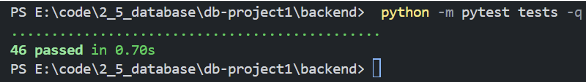

# 项目完成报告

## 1. 项目目标

本项目为基于 MongoDB 的问卷系统开发第一阶段成果，目标是实现一个可运行、可测试、可扩展的在线问卷系统，满足用户第一阶段初始需求：

- 支持用户注册、登录与 JWT 鉴权。
- 支持创建问卷、编辑问卷、发布问卷、关闭问卷与删除问卷。
- 支持四类题型：单选、多选、文本填空、数字填空。
- 支持基于答案的数据驱动跳转逻辑（不写死在程序中）。
- 支持按规则填写、校验、提交问卷，并保存每次答卷。
- 支持问卷整体统计与单题统计。
- 全流程记录 AI 使用过程，并进行人工修正与测试验证。

项目重点围绕 MongoDB 文档建模能力、后端业务逻辑设计能力、测试能力与文档能力展开。

## 2. 系统设计

### 2.1 总体架构

系统采用前后端分离架构：

- 前端：React + Vite + TypeScript（问卷管理、编辑、填写、统计界面）。
- 后端：FastAPI（路由层 + 服务层 + 模型层 + 鉴权中间件）。
- 数据库：MongoDB（users / surveys / responses 三核心集合）。

### 2.2 分层设计

后端遵循清晰分层：

- `routes/`：接收请求、参数解析、鉴权注入、统一响应。
- `services/`：核心业务逻辑（创建问卷、提交答卷、统计聚合、跳转与校验）。
- `models/`：Pydantic 模型约束请求/响应结构。
- `middlewares/`：JWT 解析与当前用户提取。
- `database.py`：MongoDB 连接与索引初始化。

### 2.3 核心业务流程

- 账号流程：注册 -> 登录 -> 获得 `access_token`。
- 问卷流程：创建草稿 -> 编辑题目与规则 -> 发布 -> 收集答卷 -> 关闭 -> 查看统计。
- 填写流程：通过访问码获取公开问卷 -> 前端按可见路径展示题目 -> 后端二次校验后入库。
- 统计流程：创建者调用统计接口 -> 服务层聚合 `responses` -> 返回分题结果。

### 2.4 关键工程策略

- 统一响应体格式：`{code, message, data}`。
- 业务码与 HTTP 状态码解耦。
- 发布状态下禁止编辑问卷结构，避免在线收集期数据错乱。
- 支持 `closed` 状态有限编辑，并在统计阶段做容错处理。

## 3. MongoDB 设计


### 3.1 集合划分

系统采用三个核心集合：

- `users`：用户账号。
- `surveys`：问卷与嵌入题目。
- `responses`：答卷与嵌入答案。

### 3.2 建模思路

- 题目嵌入 `surveys`：题目与问卷强绑定、总是一起读取，避免 JOIN。
- 答案嵌入 `responses`：单次提交是天然原子单元。
- 用户与问卷/答卷通过 `ObjectId` 引用，保持松耦合扩展能力。
- 校验规则 `validation` 与跳转规则 `logic` 均采用数据驱动字段存储。

### 3.3 关键字段设计

- `surveys.access_code`：公开访问码，用于分享填写入口。
- `surveys.deadline`：截止时间，过期后拒绝提交。
- `surveys.settings.allow_anonymous / allow_multiple`：匿名与重复提交策略。
- `surveys.response_count`：冗余统计字段，优化列表读取性能。
- `responses.is_anonymous`：显式匿名标记，配合展示层脱敏。

### 3.4 索引设计

- `users.username` 唯一索引：用户名去重与登录查找。
- `surveys.creator_id`：我的问卷列表查询。
- `surveys.access_code` 唯一索引：公开问卷定位。
- `responses(survey_id, submitted_at)`：统计与时间排序。
- `responses(survey_id, respondent_id)`：重复提交检查。

### 3.5 设计合理性

- 该结构天然适配题目/答案的异构嵌套数据。
- 读多写少场景下通过适度冗余获得更高查询性能。
- 保留了第二阶段需求变更时的可演化空间。

## 4. 跳转设计

### 4.1 跳转规则模型

每题支持独立逻辑：`logic.enabled + logic.rules[]`。

- 条件类型：
  - `select_option`（单选匹配）
  - `contains_option`（多选包含，支持 `any/all`）
  - `number_compare`（数字比较，支持 `eq/ne/gt/gte/lt/lte/between`）
- 动作类型：
  - `jump_to`（跳到指定题目）
  - `end_survey`（直接结束问卷）

### 4.2 冲突处理策略

采用“首条命中优先”策略：按规则顺序匹配，命中后立即短路执行，保证行为确定性与可控性。

### 4.3 保存期合法性校验

后端在保存问卷时进行三层校验：

- 跳转目标存在性校验（目标题必须存在）。
- 禁止向前跳转（仅允许跳到后续题，避免回跳混乱）。
- DFS 环路检测（阻断直接/间接循环跳转）。

### 4.4 提交期路径推导

提交答卷时动态计算 `required_qids`：

- 从第一题按答案逐题推导实际路径。
- `jump_to` 跳过中间题，`end_survey` 提前终止。
- 仅对路径内题目执行必答校验与答案保存。
- 对被跳过题目的恶意伪造答案执行静默丢弃，防篡改。

## 5. 校验设计

### 5.1 数据驱动校验

不同题型由 `validation` 字段驱动：

- 多选：`min_selected / max_selected / exact_selected`
- 文本：`min_length / max_length`
- 数字：`min_value / max_value / integer_only`

### 5.2 双阶段校验管线

- 问卷保存期：校验配置自身是否矛盾（如最小值大于最大值）。
- 答卷提交期：校验实际答案是否合法并返回精确错误。

### 5.3 防篡改机制

- 选择题答案会与题目选项池比对，过滤伪造 `option_id`。
- 路径外答案不会进入有效统计。
- 违反规则时统一返回业务错误码（如 `3001/3003`）与可定位文案。

## 6. AI 使用过程

本系统开发过程中使用了**claude code**、**copilot**等command line及IDE插件形式的agent工具，使用了**claude opus 4.6、claude sonnet 4.6、gpt-5.3 codex**等模型

我们通过编写**项目级自定义指令**（相当于项目级system prompt）的方式，在项目根目录添加CLAUDE.md文件，让**AI自动记录每次交互的prompt与其所作更改，之后我们再对其生成的内容进行人工审阅与修改**

具体的AI使用日志**见`AI使用过程.md`文件**

### 6.1 AI主要帮助

- **数据库初版快速建模**

  AI直接根据用户需求产出 `users / surveys / responses` 三集合方案，并给出题目嵌入、答案嵌入、索引建议，**显著降低了从 0 到 1 的设计成本**。

- **快速根据模板生成前端样式**

  根据我们提供的配色和风格要求，AI快速生成了可运行且非常美观的前端页面

- **快速搭建后端骨架**

  生成 FastAPI 项目目录、`models/routes/services` 分层、快速理清了项目结构，方便我们更好地开启模块化的正式开发，同时AI生成了数据库连接与索引初始化代码，使项目能尽快进入联调

- **补齐接口文档并严格检查**

  API接口文档需要考虑的细节很多，既要考虑**前后端联调**也要考虑和**数据库schema**是否适配，全部人工非常耗费精力。于是我们先用AI生成了 `API说明.md` 初稿，人工审阅并修改后，让不同的AI又多次进行了数据库初版建模与结构拆分，快速且精准地完成了统一响应体框架、主要端点定义，并推动前端 API 调用层和类型定义成型。

- **实现核心功能代码**

  逐个实现了包括注册登录、问卷管理、跳转逻辑、答卷提交、统计聚合功能的后端路由与服务代码初稿，以及 Dashboard/Editor/Fill/Statistics 页面初版，随后人工根据运行结果修改即可，大大提高了开发效率。

- **帮助扩展测试覆盖**

  生成并补充了大量**自动化测试**脚手架与大量用例，覆盖认证、问卷、答卷、统计、跳转合法性等模块。

### 6.2 AI做错了什么

**1. 过度设计与冗余字段（AI日志#1-2）**
- AI在 `数据库设计.md` 中设计了 `users.role`、`surveys.show_results`、`users.email` 等超纲字段，而实验第一阶段根本无此需求。
- 特别是 `show_results` 本意是向填写者公布结果，但第一阶段需求完全未涉及，应留待第二阶段扩展。
- 同时缺少了关键字段 `deadline`（截止时间）、`access_code`（分享链接）等。

**2. 对匿名与登录关系的理解模糊（AI日志#2）** 
- AI最初认为"匿名填写"意味着"无需登录"，实际上与实验需求中"所有用户必须登录"相悖。
- 这导致 API 鉴权策略不清晰。

**3. 匿名答卷在统计时身份泄露（AI日志#17）**
- AI的统计服务直接返回 `respondent_id`。问题：当用户选择"匿名"提交时，后端仍会用 `respondent_id` 标记答卷。前端按 `respondent_id` 分组后，**同一用户的匿名和实名答卷会混在一起**显示。
- 实际现象：用户 A 实名提交1次 + 匿名提交1次，结果统计页显示两份答卷都属于"用户A"。

**4. 答案存储格式设计不一致（AI日志#4）**
- AI最初设计每个答案为嵌套对象：`{"selected_options": ["opt1"]}`（多选）、`{"text": "..."}`（文本）、`{"number": 85}`（数字）。
- 问题：字段冗余，且违反单一职责（题型信息应由 question 提供）。

**5. 选项 ID 生成导致 React 渲染混乱（AI日志#18）**
- AI用简单计数生成ID：`option_id: opt${opts.length + 1}`。
- **问题场景**：问卷有3个选项（opt1/opt2/opt3），删除opt2（剩2个），添加新选项→新选项ID被生成为opt3→与旧opt3重名→React key混乱→修改一个选项时另一个也同步变化。

### 6.3 自己改了什么

**1. 数据库方案的"去冗余 + 补字段"修正**

删除超纲字段（`users.role`、`surveys.show_results`）。添加 `response_count` 冗余字段用于性能优化——避免Dashboard每次都去responses集合深层统计，改为提交时原子递增：
```python
db.surveys.update_one({"_id": ObjectId(survey_id)}, {"$inc": {"response_count": 1}})
```

**2. 字段命名与答案格式的统一**

将 `allow_anonymous`、`allow_multiple_submissions` 改为嵌套结构 `settings.allow_anonymous / settings.allow_multiple`。将问卷设置字段 `min_selections` 改为 `min_selected` 统一命名。

答案格式从嵌套对象简化为`answer: Mixed`：
```json
// AI初稿（冗余）
{"single_choice": "opt1", "selected_options": ["opt1", "opt3"]}

// 修改后（简洁）
"opt1"
["opt1", "opt3"]
```

**3. 匿名策略的三层实现**

- **第一层（鉴权）**：所有 POST /responses 必须有JWT token。
- **第二层（存储标记）**：匿名提交时设置 `respondent_id: null`，`is_anonymous: true`。
- **第三层（统计屏蔽）**：统计时为匿名答卷返回 `display_name: "匿名用户"`，前端改用 `response_id` 分组（不用 `respondent_id`），确保匿名和实名答卷物理隔离。

**4. 前端交互缺陷修复**

**(1) 选项ID冲突（AI日志#18）**：改用全局唯一的时间戳+随机数（`SurveyEditor.tsx`）：
```javascript
option_id: `opt_${Date.now().toString(36)}_${Math.random().toString(36).substring(2, 6)}`
// 例如：opt_yl10cv3_ab7f
```

**(2) min/max验证（AI日志#19）**：前后端都添加验证，前端实时提示，保存前阻止（`SurveyEditor.tsx`）：
```javascript
if (v.max_selected !== undefined && v.max_selected < v.min_selected) {
  return `最多选(${v.max_selected})不能小于最少选(${v.min_selected})`;
}
```
后端 `survey_service.py` 同步校验，保存时检查所有题目。

### 6.4 自己设计了什么

**1. 数据驱动跳转引擎 + 规则优先级机制**

跳转规则不硬编码，而是存储在MongoDB中由编辑器配置。规则结构如下（存在`question.logic.rules[]`）：
```json
{
  "rules": [
    {"conditions": [{"type": "select_option", "option_id": "opt1"}], "action": {"type": "jump_to_question", "target_question_id": "q5"}},
    {"conditions": [{"type": "number_compare", "min": 80, "max": 100}], "action": {"type": "jump_to_question", "target_question_id": "q7"}},
    {"conditions": [], "action": {"type": "end"}}
  ]
}
```

**首条命中机制**：对于**多选题跳转时多条规则可能彼此冲突**（比如一个说选择1或2跳到A题，另一个规则写选择2或3挑到B题，这样选择2时就出现了冲突）的情况，我们设计了首条命中的机制。遍历规则数组，返回与用户选择第一条匹配的action。这样规则在数组中的顺序就表示优先级（`response_service.py`）：

```python
def compute_jump_target(question, answers_dict):
    for rule in question.get("logic", {}).get("rules", []):
        if all(evaluate_condition(answers_dict, cond) for cond in rule.get("conditions", [])):
            return rule.get("action", {}).get("target_question_id")
    return None
```

**2. 跳转合法性的三层校验**

- **第一层：目标存在性**：检查target是否真存在于问卷。
- **第二层：禁止向前跳转**：不允许 `order <= current_order`，防止用户陷入困境。
- **第三层：DFS环路检测**：检测是否存在循环跳转导致无法完成。实现示例：
```python
def has_cycle(questions, start_qid, visited=None):
    if visited is None: visited = set()
    if start_qid in visited: return True
    visited.add(start_qid)
    current = next((q for q in questions if q["question_id"] == start_qid), None)
    if not current: return False
    for target in get_jump_targets(current):
        if has_cycle(questions, target, visited.copy()): return True
    return False
```

**3. 提交期动态路径推导**

假设问卷5道题，用户在第2题跳到第5题，则第3、4题对他不存在。传统方案仍要求"第3、4题必答"就不合理。

解决：提交时动态计算用户的**实际题目路径**（`required_qids`），**只对路径内题目做必答检查**。路径外的答案被静默丢弃（防止篡改且UX友好）。示例（`response_service.py`）：
```python
def compute_required_questions(survey, answers_dict):
    required = []
    qid = survey["questions"][0]["question_id"]
    while qid:
        required.append(qid)
        current_q = next((q for q in survey["questions"] if q["question_id"] == qid), None)
        next_qid = compute_jump_target(current_q, answers_dict)
        if next_qid == "END" or next_qid is None: break
        qid = next_qid
    return required
```

**4. "读多写少"性能策略**

Dashboard高频读取问卷列表，原生方案每次都查responses集合做聚合（countDocuments性能差）。

我们决定采用**冗余字段**`response_count`缓存答卷总数，提交时原子递增：
```python
db.surveys.update_one({"_id": survey_id}, {"$inc": {"response_count": 1}})
```

### 6.5 AI使用小结

现在的AI工具在根据明确的需求**快速给出框架和可运行初稿**方面效率十分高，不需要人工开发人员再做很多譬如一个一个文件一个文件创建和架构搭建的dirty work，不过在项目实际运行的细节方面考虑还不够周到，容易出现一些小bug，并且经常会进行一些过度设计和防御过度的代码，降低系统性能并且降低代码可读性，没有简洁和逻辑的美感

## 7. 测试

我们对系统采用**自动化API测试**（`backend/tests`）与**人工测试**（模拟用户使用）相结合的方式进行了测试，接下来介绍分别介绍针对本系统进行自动化测试和人工测试的过程、结果与问题解决：

### 7.1 自动化测试

#### 7.1.1 执行方式

相关测试代码在 `backend/tests`文件夹中，运行命令：

```powershell
cd backend  # 先进入后端目录
python -m pytest tests -q # 启动测试
```

**具体测试用例的输入、输出与结果见`测试用例.md`**

#### 7.1.2 遇到的问题与解决

最初测试结果基本通过，但出现如下所示的 `DeprecationWarning`：表示我们原先在问卷deadline时间相关中写的`datetime.utcnow()` 已不推荐使用。

```bash
DeprecationWarning: datetime.datetime.utcnow() is deprecated and scheduled for removal in a future version. Use timezone-aware objects to represent datetimes in UTC: datetime.datetime.now(datetime.UTC).
now = datetime.utcnow()
```

于是将后端服务层（`services/response_service.py`和`services/survey_service.py`文件）中的 UTC 时间获取统一改为**时区感知写法**（UTC-aware）：

- `datetime.utcnow()` -> `datetime.now(timezone.utc)`

不过直接这样修复后重新启动发现**后端报错**，原因时我只把用户访问的时间在后端改为了UTC-aware的写法，mongoDB数据库存的创建者设立的deadline时间在存入时**仍然没有记录时区信息**，导致用户填写时间（时区感知时间）和创建者设立deadline时间（无时区信息时间）之间在比较时出错，于是我更改了`backend/app/database.py`中的deadline时间设置，增加时区感知的配置，更加完善：

```python
_client = MongoClient(settings.MONGODB_URI, tz_aware=True, tzinfo=timezone.utc)
```

同时在`backend/app/services/survey_service.py`和`backend/app/services/response_service.py`中分别添加`_to_utc_aware()`函数，保证deadline时间数据入库前统一为 UTC-aware

#### 7.1.2 结果

修复后系统无报错且自动化测试重新执行通过（`46 passed`），原 `utcnow()` 相关 warning 不再出现。（可见自动化测试可以帮助我们高效发现系统不易察觉的细节bug！）



### 7.2 人工测试

人工测试就是手动模拟用户可能的行为并人工判定系统响应是否正确，实际上贯穿我们开发该问卷系统功能的始终，用于及时验证AI回复和代码逻辑是否正确，下面仅展示两个我们在系统开发后期的测试与修复例子：

#### 7.2.1 修复项一：匿名答卷泄露 respondent_id + 前端错误分组

由于第一阶段需求中写的“填写问卷都要先登录”，但是又要求能够匿名回答，需要达到一种“**系统得知而创建者不知**”的效果。按照这个需求和逻辑实现后，我们按照以下流程进行**人工测试**：

- 使用同一个账号先后用实名和匿名回答同一份问卷
- 进入统计页“答卷列表”视图
- 检查分组与用户名显示

结果发现同**账号匿名与实名答卷被合并**，即若该组最新记录为匿名，整组显示会被“匿名用户”覆盖，影响实名记录展示。

**原因在于**：即使是“匿名回复”，后端答卷列表仍返回真实 `respondent_id`，于是前端按 `respondent_id` 分组后，会将前后同一个`respondent_id`合并为同一个记录，于是先前的实名记录和匿名记录就分不开了。

**修复如下**：

1. 后端修复（`backend/app/services/response_service.py`）

- 在 `get_response_list` 组装返回数据时：
- 匿名答卷返回 `respondent_id: None`。
- 实名答卷才返回真实 `respondent_id` 与 `respondent_name`。

2. 前端修复（`frontend/src/components/StatisticsView.tsx`）

- 调整 `groupedResponses`：
- 匿名答卷按 `response_id` 单独分组。
- 实名答卷才按 `respondent_id` 分组。

**修复后效果**：

- 匿名记录不再泄露真实 `respondent_id`。
- 匿名答卷与实名答卷不再被错误合并。
- 实名记录用户名显示正常，匿名记录显示“匿名用户”。


#### 7.2.1 修复项二：编辑问卷选项时两个选项同步变化

在“题目编辑”页面，系统支持创建者用户调整题目选项，然而在人工测试流程测试该功能时，我们发现：

- 打开问卷编辑页，保证题目有至少 2 个选项
- 删除第 1 个选项，再新增一个选项
- 修改现在的两个选项的其中一个选项
- **两个选项一起同步被修改**

**原因在于**：删除选项 1 后再新增选项，可能生成与已有项重复的 `option_id`。在 React 列表渲染中，重复 key 会导致编辑一个选项时另一个选项同步变化。

**修复如下**：

文件：`frontend/src/components/SurveyEditor.tsx`

- 原逻辑：`option_id: opt${opts.length + 1}`（存在碰撞风险）。
- 修复后：`option_id` 改为 `opt_${时间戳36进制}_${随机片段}`，保证新增选项 ID 唯一。

**修复后效果**：

- 选项不再出现同步联动修改。
- 每个选项可独立编辑，渲染稳定。

## 8. 总结与分工

本项目成功完成了 MongoDB 问卷系统第一阶段的用户在**账号功能、问卷创建与管理、问卷题目、题目跳转、填写问卷、查看统计结果**的所有需求，设计了由`users`、`surveys`、`responses`三个集合组成的数据库结构，借助AI工具和人工审核修改实现了高效且准确的系统开发，完成并且通过了自动化测试与人工使用测试。

通过本次一阶段工作，我们对**MongoDB 文档建模**、**后端业务设计**、**前后端协作**都有了更深入的理解，同时也在两人合作中增长了**团队协作开发**的经验，我们的分工与协作方式如下：

- **共同合作阶段**：

  - **丁熙妍**：完成**MongoDB数据库设计**文档

  - **吴晨曦**：完成**统一API接口说明**文档
  - **相互审阅对方设计与文档并修复问题，最终达成统一共识**

- **分模块同步开发阶段**：

  - **丁熙妍**：实现**登录注册、创建问卷**等功能后端逻辑与前后端适配

  - **吴晨曦**：实现**编辑问卷、问卷题目设计、题目跳转、统计结果展示**等功能后端逻辑与前后端适配
  - **共同测试修复并完善测试用例**

- **文档总结阶段**：

  - **丁熙妍**：完成**业务逻辑展示、MongoDB设计、关键逻辑说明、测试用例**部分文档

  - **吴晨曦**：完成**AI使用说明、测试过程结果**部分文档


