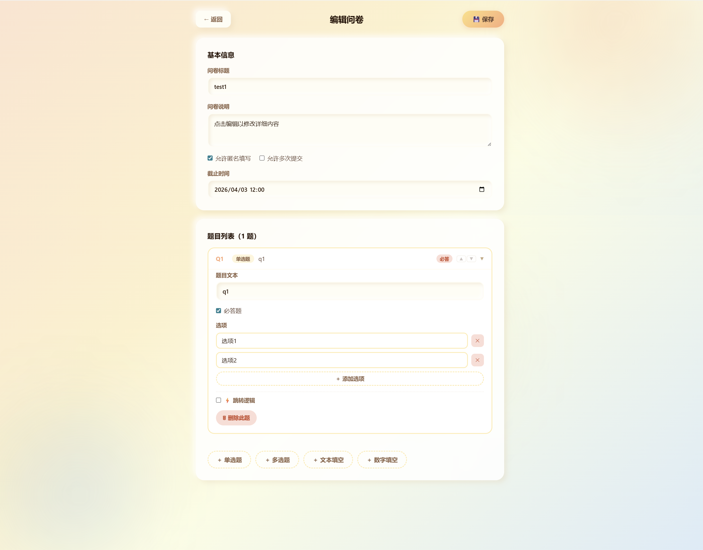
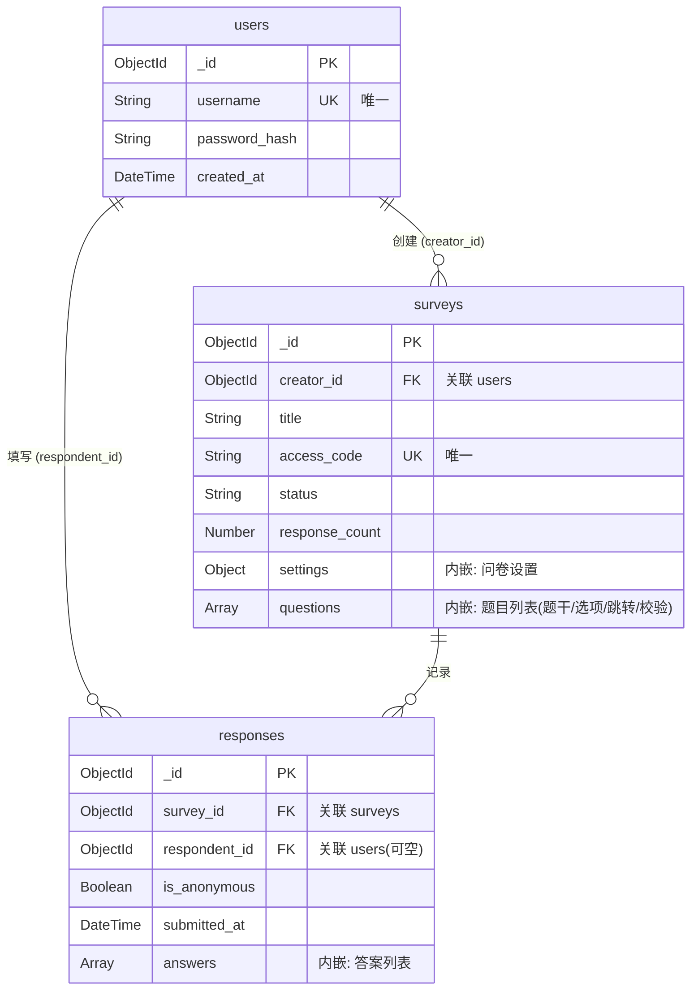

# 项目完成报告（第一阶段）

## 1. 项目目标

本项目为基于 MongoDB 的问卷系统开发第一阶段成果，目标是实现一个可运行、可测试、可扩展的在线问卷系统，满足用户第一阶段初始需求：

- 支持用户注册、登录与 JWT 鉴权。
- 支持创建问卷、编辑问卷、发布问卷、关闭问卷与删除问卷。
- 支持四类题型：单选、多选、文本填空、数字填空。
- 支持基于答案的数据驱动跳转逻辑（不写死在程序中）。
- 支持按规则填写、校验、提交问卷，并保存每次答卷。
- 支持问卷整体统计与单题统计。
- 全流程记录 AI 使用过程，并进行人工修正与测试验证。

项目重点围绕 MongoDB 文档建模能力、后端业务逻辑设计能力、测试能力与文档能力展开。

## 2. 系统设计

### 2.1 总体架构

系统采用前后端分离架构：

- 前端：React + Vite + TypeScript（问卷管理、编辑、填写、统计界面）。
- 后端：FastAPI（路由层 + 服务层 + 模型层 + 鉴权中间件）。
- 数据库：MongoDB（users / surveys / responses 三核心集合）。

### 2.2 分层设计

后端遵循清晰分层：

- `routes/`：接收请求、参数解析、鉴权注入、统一响应。
- `services/`：核心业务逻辑（创建问卷、提交答卷、统计聚合、跳转与校验）。
- `models/`：Pydantic 模型约束请求/响应结构。
- `middlewares/`：JWT 解析与当前用户提取。
- `database.py`：MongoDB 连接与索引初始化。

### 2.3 核心业务流程

#### 2.3.1 账号流程

注册 -> 登录 -> 获得 `access_token`

**注册界面：**


**登录界面：**


#### 2.3.2 问卷流程

创建草稿 -> 编辑题目与规则 -> 发布 -> 收集答卷 -> 关闭 -> 查看统计

**问卷管理界面（Dashboard）：**


用户可以查看所有创建的问卷，包括标题、状态、答卷数等信息，支持编辑、分享、查看统计等操作。

**问卷编辑界面：**



支持添加四种题型（单选、多选、文本、数字），配置校验规则和跳转逻辑。

**问卷分享界面：**


发布后生成唯一访问码，用户可通过链接分享问卷。

#### 2.3.3 填写流程

通过访问码获取公开问卷 -> 前端按可见路径展示题目 -> 后端二次校验后入库

**问卷填写界面：**


采用长列表滚动模式，根据跳转逻辑实时显示/隐藏题目，用户可直观感知跳转效果。

#### 2.3.4 统计流程

创建者调用统计接口 -> 服务层聚合 `responses` -> 返回分题结果

**统计查看界面：**


支持查看整体统计（总答卷数、完成率等）和分题统计（选项分布、答卷列表等），匿名答卷自动脱敏显示。

**答卷列表界面：**


支持查看每个用户的答卷详情，实名答卷显示用户名，匿名答卷显示"匿名用户"并自动脱敏。

### 2.4 关键工程策略

#### 2.4.1 统一响应体格式

系统采用统一的 JSON 响应格式：

```json
{
  "code": 0,           // 业务状态码（0表示成功，非0表示各类错误）
  "message": "成功",   // 人类可读的提示信息
  "data": {...}        // 实际业务数据（成功时返回，失败时可为null）
}
```

**设计优势：**

- 前端可统一处理响应，通过 `code` 判断业务成功/失败，无需依赖 HTTP 状态码。
- `message` 字段可直接展示给用户，提供友好的错误提示。
- 业务逻辑与传输层解耦，便于后续扩展（如添加 `trace_id`、`timestamp` 等字段）。

#### 2.4.2 业务码与 HTTP 状态码解耦

系统将业务错误码与 HTTP 状态码分离：

- **HTTP 状态码：** 仅表示传输层状态（200成功、400客户端错误、500服务器错误）。
- **业务错误码：** 表示具体的业务错误类型（如 `1001`用户不存在、`2002`问卷不存在、`3001`必答题未回答）。

**示例：**

```python
# 用户未登录
return JSONResponse(
    status_code=401,  # HTTP层：未授权
    content={"code": 1003, "message": "未登录或token已过期", "data": None}
)

# 问卷不存在
return JSONResponse(
    status_code=404,  # HTTP层：资源不存在
    content={"code": 2002, "message": "问卷不存在", "data": None}
)
```

**设计优势：**

- 前端可根据业务码精确处理不同错误场景（如 `1003` 跳转登录页、`2002` 提示问卷已删除）。
- 便于日志分析和问题定位（通过业务码快速过滤特定类型错误）。
- 符合 RESTful API 最佳实践。

#### 2.4.3 问卷状态机与编辑权限控制

系统通过状态机严格控制问卷的编辑权限：

**状态转换规则：**

```
draft（草稿） → published（已发布） → closed（已关闭）
     ↓                                      ↓
  可自由编辑                            允许有限编辑
```

**编辑权限矩阵：**

| 状态        | 可编辑内容                 | 限制原因                                     |
| ----------- | -------------------------- | -------------------------------------------- |
| `draft`     | 所有字段和题目结构         | 未发布，无答卷数据，可自由修改               |
| `published` | 仅问卷标题、描述、截止时间 | 正在收集答卷，修改题目结构会导致数据不一致   |
| `closed`    | 所有字段和题目结构         | 已停止收集，创建者可能需要修正错误或调整问卷 |

**实现机制：**

- 后端在更新问卷时检查 `status` 字段，`published` 状态下拒绝修改 `questions` 数组。
- 前端编辑页面根据状态禁用/启用相应的编辑控件。
- 状态转换单向进行（`draft` → `published` → `closed`），不可回退，保证数据一致性。

#### 2.4.4 容错机制与数据完整性保护

针对 `closed` 状态下的问卷修改，系统实现了完善的容错机制：

**问题场景：**

- 创建者在 `closed` 状态下删除了某个题目或选项。
- 历史答卷中仍包含对已删除题目/选项的引用（"孤儿数据"）。

**容错策略：**

1. **统计引擎容错：**
   - 检测孤儿数据（`question_id` 或 `option_id` 在当前问卷定义中不存在）。
   - 自动跳过孤儿数据，不影响有效数据的统计。
   - 在统计结果中添加 `warning` 字段，告知数据不完整的原因。

2. **前端提示：**
   - 编辑页面显示警告横幅："该问卷已有 X 份答卷，修改题目结构可能影响统计结果"。
   - 统计页面显示警告信息："部分答卷包含已删除的题目，统计结果可能不完整"。

3. **数据保护：**
   - 不自动删除或修改历史答卷数据，保留原始记录。
   - 创建者可选择导出原始数据进行人工分析。

**设计权衡：**

- **不采用强制数据迁移：** 避免复杂度高、风险大、性能差的批量更新操作。
- **不禁止 `closed` 状态编辑：** 提供最大灵活性，允许创建者修正错误。
- **通过容错保证可用性：** 即使存在孤儿数据，系统仍能正常统计有效数据。

## 3. MongoDB 设计

### 3.1 集合划分

系统采用三个核心集合，其整体结构与关联关系如下 ER 图所示：



#### 3.1.1 users（用户）集合

存储账户基础凭证信息，保持最小字段集合以应对后期演进。

```json
{
  "_id": ObjectId,
  "username": String,        // 唯一用户名
  "password_hash": String,   // bcrypt 哈希
  "created_at": DateTime
}
```

**核心索引：** `username`（唯一索引，用于登录去重与查找）

#### 3.1.2 surveys（问卷）集合

作为聚合根，内嵌问卷配置及完整的题目结构。

```json
{
  "_id": ObjectId,
  "title": String,
  "creator_id": ObjectId,        // 关联用户
  "access_code": String,         // 唯一分享码
  "status": String,              // "draft" | "published" | "closed"
  "response_count": Number,      // 答卷冗余计数（通过原子递增维护）
  "settings": {
    "allow_anonymous": Boolean,
    "allow_multiple": Boolean
  },
  "questions": [                 // 嵌入的所有题目
    {
      "question_id": String,
      "type": String,            // "single_choice" 等4种题型
      "title": String,
      "options": [{ "option_id": String, "text": String }],
      "validation": Object,      // 约束规则（字数、范围限制，详见第5章）
      "logic": Object            // 分支跳转逻辑（详见第4章）
    }
  ]
  // 略除：description, created_at, updated_at, deadline 等基础字段
}
```

**核心索引：**

- `creator_id`（用于“我的问卷”列表）
- `access_code`（唯一索引，用于分享链接定点查找）
- `status` + `created_at`（复合索引，用于列表按状态排序展示）

#### 3.1.3 responses（答卷）集合

作为单次收集闭环的原子单元，记录完整作答快照。

```json
{
  "_id": ObjectId,
  "survey_id": ObjectId,
  "respondent_id": ObjectId,     // 答题者（匿名提交时为 null）
  "is_anonymous": Boolean,       // 是否匿名策略支持
  "submitted_at": DateTime,
  "answers": [                   // 用户的结构化答案内嵌数组
    {
      "question_id": String,
      "answer": Mixed            // String / [String] / Number 等多态值
    }
  ],
  "completion_time": Number      // 完成问卷所用秒数（可选）
}
```

**核心索引：**

- `survey_id` + `submitted_at`（复合索引，服务于大量统计查询与时间序）
- `survey_id` + `respondent_id`（复合索引，用于阻断恶意重复提交）
- `respondent_id`（用于“我的填写”记录）

### 3.2 建模思路

#### 3.2.1 嵌入式文档的运用

**题目嵌入问卷：**

- 题目与问卷是强一对多关系，业务上总是一起查询（编辑页、填写页都需要完整题目列表）。
- 一次查询即可获取问卷及所有题目，避免 JOIN 操作。
- 更新问卷结构时，题目作为嵌入文档与问卷一起更新，保证原子性。

**答案嵌入答卷：**

- 一次提交的所有答案属于同一个原子操作单元，不可拆分。
- 查询某次答卷时一次读取所有答案，统计时批量读取所有答卷。
- 答案与答卷记录绑定，避免孤儿答案。

**用户与问卷/答卷使用引用：**

- 用户与问卷/答卷是多对多关系，且用户信息可能独立变更。
- 便于后续添加用户相关功能（用户画像、权限管理）。
- 避免在每个问卷/答卷中重复存储完整用户信息。

#### 3.2.2 数据驱动设计

**校验规则 `validation`：**

- 不同题型的校验规则以 JSON 结构存储在文档中。
- 后端读取后执行校验，完全避免硬编码。
- 支持灵活配置（多选题限制数量、文本限制字数、数字限制范围）。

**跳转规则 `logic`：**

- 跳转条件和动作以数据形式存储，支持三种条件类型和两种动作类型。
- 后端根据用户答案动态计算跳转路径，无需预先编写所有分支逻辑。
- 保存时执行三层校验（目标存在性、禁止向前跳转、环路检测）。

### 3.3 冗余设计：response_count 字段

**设计背景：**

在问卷列表页（Dashboard），需要展示每个问卷的已收集答卷数。如果采用规范化设计，每次查询列表都需要对每个问卷执行一次 `count_documents` 操作：

```python
# 低效做法：N+1 查询问题
for survey in surveys:
    count = db.responses.count_documents({"survey_id": survey["_id"]})
    survey["response_count"] = count
```

假设用户有 50 个问卷，需要执行 51 次数据库查询（1 次查问卷列表 + 50 次 count），在答卷数量达到百万级时性能会急剧下降。

**优化方案：**

在 `surveys` 文档中直接存储 `response_count` 冗余字段，每次提交答卷时通过原子操作递增：

```python
# 插入答卷后原子递增计数
db.surveys.update_one(
    {"_id": ObjectId(survey_id)},
    {"$inc": {"response_count": 1}}  # MongoDB 原子操作
)
```

**并发安全性：**

MongoDB 的 `$inc` 操作符是原子的，即使多个用户同时提交答卷也不会出现计数错误。传统的"读取-计算-写回"模式在并发场景下会导致数据丢失，而原子操作在数据库层面保证了线程安全。

**性能收益量化：**

- **查询次数：** 从 O(n) 次降低到 1 次（n 为问卷数）
- **响应时间：** 从约 5 秒（50 个问卷 × 100ms count）降低到约 50ms（单次查询）
- **写入开销：** 每次提交增加约 1ms 的 `$inc` 操作，几乎可忽略

这是典型的"读多写少"场景优化：用极小的写入开销换取巨大的读取性能提升。

### 3.4 索引设计

- `users.username` 唯一索引：用户名去重与登录查找。
- `surveys.creator_id`：我的问卷列表查询。
- `surveys.access_code` 唯一索引：公开问卷定位。
- `responses(survey_id, submitted_at)`：统计与时间排序。
- `responses(survey_id, respondent_id)`：重复提交检查。

### 3.5 设计合理性

#### 3.5.1 混合关系建模（嵌入 vs 引用）

- **强绑定用嵌入：** 题目归属问卷，答案归属答卷；保证一次性读写的原子性与一致性，彻底消除多表 JOIN 发销。
- **松耦合用引用：** 用户与问卷、答卷使用独立引用，规避数据冗余，便于拓展后续用户体系功能。

#### 3.5.2 对比关系数据库核心优势

1. **天然适配异构表单：** 题目的校验、跳转选项等结构差异极大，文档模型一站解决，免去传统 SQL 拆分多表的繁琐及大量可空列。
2. **读写性能显著提升：** “问卷+题目”直接一次查询即返回完整数据，免去关系库复杂的连表（如：问卷 JOIN 题目 JOIN 选项）瓶颈。
3. **零成本 Schema 演进：** 面对“第二阶段”需求扩展（如配置题库版本），文档模型可无缝热新增字段，规避庞大的 ALTER 操作。

#### 3.5.3 适度冗余带来的检索极速化

通过预留 `response_count` 并依赖 `db.collection.update($inc)` 原子递增，将问卷列表的答卷量统计时耗从 O(n) 级 count 退化为 O(1) 取值。在典型的读多写少架构中极大保障了响应速率。

## 4. 跳转设计

为了实现类似"问卷星"的动态答题体验，系统实现了一套基于条件分支的跳转引擎，分为"问卷定义期的合法性校验"与"用户答卷时的路径计算"两部分。

### 4.1 跳转规则模型

每题支持独立逻辑：`logic.enabled + logic.rules[]`，每条规则由"触发条件"和"执行动作"组成。

#### 4.1.1 触发条件的三种类型

**`select_option`（单选匹配）：**

当用户选择了指定的某个选项时触发。

- **应用场景：** "您的年龄段？" 选择 "18岁以下" 时跳过后续成人内容题目。
- **配置示例：** `{type: "select_option", option_id: "opt_under18"}`

**`contains_option`（多选包含）：**

当用户的多选答案中包含指定选项时触发，支持 `any`（包含任一）和 `all`（包含全部）两种匹配模式。

- **应用场景：** "您感兴趣的领域？" 选择了 "编程" 时跳转到技术相关题目。
- **配置示例：** `{type: "contains_option", option_ids: ["opt_coding"], match_type: "any"}`

**`number_compare`（数字比较）：**

支持 7 种比较操作符（`eq`/`ne`/`gt`/`gte`/`lt`/`lte`/`between`），用于数值题的条件判断。

- **应用场景：** "您的月收入？" 大于 10000 时跳转到高端消费调查。
- **配置示例：** `{type: "number_compare", operator: "gt", value: 10000}`

#### 4.1.2 执行动作的两种类型

**`jump_to`：** 跳转到指定的 `target_question_id`，跳过中间所有题目。

**`end_survey`：** 强制结束问卷，用户无需回答后续任何题目（例如筛选不符合条件的受访者）。

### 4.2 冲突处理策略

#### 4.2.1 冲突场景示例

在多选题或同题多条条件判断的场景中，用户提交的答案可能会同时满足多条不同的跳转规则。

假设题目"您感兴趣的领域？"有三条跳转规则：

- 规则 1：选择了"编程" → 跳转到题目 Q5（技术调查）
- 规则 2：选择了"设计" → 跳转到题目 Q8（创意调查）
- 规则 3：选择了"管理" → 结束问卷

当用户同时选择了"编程"和"设计"时，规则 1 和规则 2 都满足，此时应该跳转到 Q5 还是 Q8？

#### 4.2.2 解决策略：首条命中优先

系统采用**顺序短路匹配策略**：按规则数组顺序从上至下判定，一旦命中某条规则立即执行该动作，并直接中断对后续规则的评估。

**实现原理（`response_service.py` 中的 `compute_jump_target()` 函数）：**

```python
for rule in rules:
    condition = rule.get("condition", {})
    action = rule.get("action", {})
    if evaluate_condition(condition, answer):
        # 第一个命中的规则立即生效，后续规则不再评估
        if action_type == "end_survey":
            return "__END__"
        elif action_type == "jump_to":
            return action.get("target_question_id")
```

**设计优势：**

- **行为确定性：** 严格按照问卷结构中定义的规则数组顺序，保证相同输入产生相同输出。
- **短路评估：** 一旦命中规则立即执行，避免不必要的计算，提升性能。
- **设计者控制权：** 将核心控制权交给问卷设计者，遇互斥重叠条件时，仅需将"高优先级"规则前置即可。

### 4.3 保存期合法性校验

为保证跳转逻辑的正确性和安全性，系统在保存问卷时执行严密校验（`survey_service.py` 中的 `_validate_jump_logic()` 函数）。

#### 4.3.1 第一层：目标存在性校验

```python
qid_set = {q["question_id"] for q in questions}
if target and target not in qid_set:
    return f"「{q.get('title')}」的跳转目标「{target}」不存在"
```

- 构建题目 ID 集合，确保 `jump_to` 目标 ID 必须真实存在于当前题目列表。
- 防止因手动输入错误或删除题目后未清理跳转规则导致的"跳转到虚空"问题。

#### 4.3.2 第二层：禁止向前跳转

```python
qid_to_order = {q["question_id"]: q.get("order", 0) for q in questions}
if target and qid_to_order.get(target, 0) <= qid_to_order.get(q["question_id"], 0):
    return f"「{q.get('title')}」不允许向前跳转到「{target}」"
```

- 构建题目 ID 到序号（`order`）的映射表，确保目标题目的序号必须严格大于当前题目。
- 从根本上阻断向前跳转，避免用户在答题时陷入"回到之前题目"的混乱状态。

#### 4.3.3 第三层：环路检测（DFS 算法）

```python
def has_cycle(start_qid: str, visited: set) -> bool:
    if start_qid in visited:
        return True  # 检测到环路
    visited.add(start_qid)
    # 递归检查所有可能的跳转目标
    for rule in logic.get("rules", []):
        if action.get("type") == "jump_to":
            target = action.get("target_question_id")
            if target and has_cycle(target, visited.copy()):
                return True
    return False
```

- 运用深度优先搜索（DFS）算法开展有向图环路检测。
- 即使是间接循环（Q1 → Q3 → Q5 → Q3），也会被识别并拒绝保存。
- 错误提示会明确指出涉及循环的题目，方便问卷设计者定位问题。

### 4.4 提交期路径推导

在用户正式提交答卷时，后端的防伪路径推导引擎开始执行（`response_service.py` 中的 `compute_required_questions()` 函数）。

#### 4.4.1 路径计算流程

```python
def compute_required_questions(questions: List[Dict], answers_map: Dict[str, Any]) -> List[str]:
    required = []
    idx = 0
    while idx < len(questions):
        q = questions[idx]
        qid = q["question_id"]
        required.append(qid)

        # 获取用户对该题的答案
        answer = answers_map.get(qid)
        if answer is not None:
            jump_target = compute_jump_target(q, answer)
            if jump_target == "__END__":
                break  # 结束问卷
            elif jump_target:
                # 跳转到目标题目
                target_idx = next((i for i, q in enumerate(questions) if q["question_id"] == jump_target), None)
                if target_idx is not None:
                    idx = target_idx
                    continue
        idx += 1
    return required
```

#### 4.4.2 核心机制

- **动态路径计算：** 从第一题开始，根据用户的实际答案逐题推导，生成 `required_qids` 列表（本次答卷实际应当回答的题目 ID 列表）。
- **跳转执行：** 遇到 `jump_to` 时直接跳转到目标题目索引，跳过中间所有题目；遇到 `end_survey` 时立即终止循环。
- **脏数据过滤：** 提交校验时，只有 `required_qids` 列表内的题目才被承认有效并要求"必答校验"。

#### 4.4.3 防篡改示例

假设问卷有 Q1、Q2、Q3、Q4 四题，Q1 选择"A"时跳转到 Q4。

- **正常用户：** 提交 `{Q1: "A", Q4: "答案"}`，路径推导得到 `required_qids = [Q1, Q4]`，校验通过。
- **恶意用户：** 提交 `{Q1: "A", Q2: "伪造", Q3: "伪造", Q4: "答案"}`，路径推导仍得到 `required_qids = [Q1, Q4]`，Q2 和 Q3 的答案被识别为"不在必答列表中"而被静默丢弃。

若用户通过截包或篡改等异常手段提交了被跳过题目的野答案，引擎将直接静默抛弃之，保证逻辑自洽。

## 5. 校验设计

系统结合 Pydantic 模型，开发了高度参数化且基于数据驱动的表单校验引擎。不同题型的校验规则完全由数据库中的 `validation` 字段驱动，无需硬编码。

### 5.1 数据驱动校验

`QuestionValidation` 对象可按不同题型携带不同约束，所有规则存储在数据库中，后端读取后执行校验。

#### 5.1.1 多选题校验（`multiple_choice`）

```python
validation = {
    "min_selected": 2,  # 至少选择 2 项
    "max_selected": 5,  # 最多选择 5 项
    "exact_selected": None  # 或精确要求选择 N 项
}
```

- 支持"至少选几项"、"最多选几项"、"精确选几项"三种约束。
- **应用场景：** "请选择 2-3 个您最喜欢的功能"。
- `exact_selected` 优先级高于 `min/max`，如果设置则忽略范围约束。

#### 5.1.2 文本题校验（`text_input`）

```python
validation = {
    "min_length": 10,   # 最少输入 10 个字符
    "max_length": 500   # 最多输入 500 个字符
}
```

- 防止用户敷衍（最小字数）和灌水（最大字数）。
- **应用场景：** "请详细描述您的建议（至少 50 字）"。
- 字符数统计包含空格和标点符号。

#### 5.1.3 数字题校验（`number_input`）

```python
validation = {
    "min_value": 0,       # 最小值
    "max_value": 150,     # 最大值
    "integer_only": True  # 是否只允许整数
}
```

- 限制数值范围，防止异常输入（如年龄输入 -10 或 999）。
- 支持整数约束（如"请输入您的年龄"只能是整数）。
- **应用场景：** "您的年龄（0-150岁）"、"您的身高（cm，整数）"。

### 5.2 双阶段校验管线

验证包含两个阶段，分别在问卷保存期和答卷提交期执行，确保配置合理且答案合法。

#### 5.2.1 阶段一：配置自查期（问卷保存时）

`survey_service.py` 中的 `_validate_question_validation()` 函数在保存问卷时检查配置合理性：

```python
# 多选题验证
if q_type == "multiple_choice":
    min_sel = validation.get("min_selected")
    max_sel = validation.get("max_selected")
    if min_sel is not None and max_sel is not None and max_sel < min_sel:
        return f"「{q_title}」最多选择项({max_sel})不能小于最少选择项({min_sel})"

# 文本题验证
if q_type == "text_input":
    min_len = validation.get("min_length")
    max_len = validation.get("max_length")
    if min_len is not None and max_len is not None and max_len < min_len:
        return f"「{q_title}」最大长度({max_len})不能小于最小长度({min_len})"

# 数字题验证
if q_type == "number_input":
    min_val = validation.get("min_value")
    max_val = validation.get("max_value")
    if min_val is not None and max_val is not None and max_val < min_val:
        return f"「{q_title}」最大值({max_val})不能小于最小值({min_val})"
```

**设计目的：**

- 确认最值关系必须合理（`max_length` 不能小于 `min_length`、`max_value` 不能小于 `min_value` 等）。
- 在问卷设计阶段就拦截配置错误，避免用户答题时遇到无法满足的矛盾约束。
- 提供精确的错误提示，包含题目标题和具体冲突值，方便问卷设计者快速定位问题。

#### 5.2.2 阶段二：提交运行时（答卷提交时）

`response_service.py` 中的 `_validate_answer()` 函数在用户提交时执行实际校验：

**选择题防篡改：**

```python
# 构建有效选项 ID 集合
valid_option_ids = {opt["option_id"] for opt in question.get("options", [])}

if q_type == "single_choice":
    if answer not in valid_option_ids:
        raise ResponseServiceError(ErrorCodes.INVALID_ANSWER,
            f"「{q_title}」的选项不合法", 400)

elif q_type == "multiple_choice":
    if not isinstance(answer, list):
        raise ResponseServiceError(...)
    # 过滤掉伪造的 option_id
    answer = [opt for opt in answer if opt in valid_option_ids]

    # 校验选择数量
    if exact_selected is not None and len(answer) != exact_selected:
        raise ResponseServiceError(...)
    if min_selected is not None and len(answer) < min_selected:
        raise ResponseServiceError(...)
    if max_selected is not None and len(answer) > max_selected:
        raise ResponseServiceError(...)
```

**文本题校验：**

```python
if q_type == "text_input":
    text_len = len(answer)
    if min_length is not None and text_len < min_length:
        raise ResponseServiceError(ErrorCodes.INVALID_ANSWER,
            f"「{q_title}」至少需要 {min_length} 个字符", 400)
    if max_length is not None and text_len > max_length:
        raise ResponseServiceError(ErrorCodes.INVALID_ANSWER,
            f"「{q_title}」最多允许 {max_length} 个字符", 400)
```

**数字题校验：**

```python
if q_type == "number_input":
    if integer_only and not isinstance(answer, int):
        raise ResponseServiceError(ErrorCodes.INVALID_ANSWER,
            f"「{q_title}」必须是整数", 400)
    if min_value is not None and answer < min_value:
        raise ResponseServiceError(...)
    if max_value is not None and answer > max_value:
        raise ResponseServiceError(...)
```

### 5.3 防篡改与精确报错响应

通过前述的“双阶段校验管线”与第4节的“动态路径推导”，系统实现了坚固的防篡改与容错机制：

1. **选项池严格比对：** 引擎自动过滤 payload 中伪造的 `option_id`（详见5.2.2防篡改代码）。
2. **路径外数据过滤：** 结合动态路径，被跳过题目的答案（即使用户伪造提交）会被静默丢弃，不会进入数据库，保证逻辑自洽。
3. **精准错误定位：** 发生边界违规时，后端统一返回带具体业务错误码（如 `3001`、`3003`）与题目标题的可视化文案（如`"「您的年龄」必须是整数"`），极大简化前端联调成本并提升用户体验。

## 6. AI 使用过程

本系统开发过程中使用了**claude code**、**copilot**等command line及IDE插件形式的agent工具，使用了**claude opus 4.6、claude sonnet 4.6、gpt-5.3 codex**等模型

我们通过编写**项目级自定义指令**（相当于项目级system prompt）的方式，在项目根目录添加CLAUDE.md文件，让**AI自动记录每次交互的prompt与其所作更改，之后我们再对其生成的内容进行人工审阅与修改**

具体的AI使用日志**见`AI使用过程.md`文件**

### 6.1 AI主要帮助

- **数据库初版快速建模**

  AI直接根据用户需求产出 `users / surveys / responses` 三集合方案，并给出题目嵌入、答案嵌入、索引建议，**显著降低了从 0 到 1 的设计成本**。

- **快速根据模板生成前端样式**

  根据我们提供的配色和风格要求，AI快速生成了可运行且非常美观的前端页面

- **快速搭建后端骨架**

  生成 FastAPI 项目目录、`models/routes/services` 分层、快速理清了项目结构，方便我们更好地开启模块化的正式开发，同时AI生成了数据库连接与索引初始化代码，使项目能尽快进入联调

- **补齐接口文档并严格检查**

  API接口文档需要考虑的细节很多，既要考虑**前后端联调**也要考虑和**数据库schema**是否适配，全部人工非常耗费精力。于是我们先用AI生成了 `API说明.md` 初稿，人工审阅并修改后，让不同的AI又多次进行了数据库初版建模与结构拆分，快速且精准地完成了统一响应体框架、主要端点定义，并推动前端 API 调用层和类型定义成型。

- **实现核心功能代码**

  逐个实现了包括注册登录、问卷管理、跳转逻辑、答卷提交、统计聚合功能的后端路由与服务代码初稿，以及 Dashboard/Editor/Fill/Statistics 页面初版，随后人工根据运行结果修改即可，大大提高了开发效率。

- **帮助扩展测试覆盖**

  生成并补充了大量**自动化测试**脚手架与大量用例，覆盖认证、问卷、答卷、统计、跳转合法性等模块。

### 6.2 AI做错了什么

**1. 过度设计与冗余字段（AI日志#1-2）**
- AI在 `数据库设计.md` 中设计了 `users.role`、`surveys.show_results`、`users.email` 等超纲字段，而实验第一阶段根本无此需求。
- 特别是 `show_results` 本意是向填写者公布结果，但第一阶段需求完全未涉及，应留待第二阶段扩展。
- 同时缺少了关键字段 `deadline`（截止时间）、`access_code`（分享链接）等。

**2. 对匿名与登录关系的理解模糊（AI日志#2）** 
- AI最初认为"匿名填写"意味着"无需登录"，实际上与实验需求中"所有用户必须登录"相悖。
- 这导致 API 鉴权策略不清晰。

**3. 匿名答卷在统计时身份泄露（AI日志#17）**
- AI的统计服务直接返回 `respondent_id`。问题：当用户选择"匿名"提交时，后端仍会用 `respondent_id` 标记答卷。前端按 `respondent_id` 分组后，**同一用户的匿名和实名答卷会混在一起**显示。
- 实际现象：用户 A 实名提交1次 + 匿名提交1次，结果统计页显示两份答卷都属于"用户A"。

**4. 答案存储格式设计不一致（AI日志#4）**
- AI最初设计每个答案为嵌套对象：`{"selected_options": ["opt1"]}`（多选）、`{"text": "..."}`（文本）、`{"number": 85}`（数字）。
- 问题：字段冗余，且违反单一职责（题型信息应由 question 提供）。

**5. 选项 ID 生成导致 React 渲染混乱（AI日志#18）**
- AI用简单计数生成ID：`option_id: opt${opts.length + 1}`。
- **问题场景**：问卷有3个选项（opt1/opt2/opt3），删除opt2（剩2个），添加新选项→新选项ID被生成为opt3→与旧opt3重名→React key混乱→修改一个选项时另一个也同步变化。

### 6.3 自己改了什么

**1. 数据库方案的"去冗余 + 补字段"修正**

删除超纲字段（`users.role`、`surveys.show_results`）。添加 `response_count` 冗余字段用于性能优化——避免Dashboard每次都去responses集合深层统计，改为提交时原子递增：
```python
db.surveys.update_one({"_id": ObjectId(survey_id)}, {"$inc": {"response_count": 1}})
```

**2. 字段命名与答案格式的统一**

将 `allow_anonymous`、`allow_multiple_submissions` 改为嵌套结构 `settings.allow_anonymous / settings.allow_multiple`。将问卷设置字段 `min_selections` 改为 `min_selected` 统一命名。

答案格式从嵌套对象简化为`answer: Mixed`：
```json
// AI初稿（冗余）
{"single_choice": "opt1", "selected_options": ["opt1", "opt3"]}

// 修改后（简洁）
"opt1"
["opt1", "opt3"]
```

**3. 匿名策略的三层实现**

- **第一层（鉴权）**：所有 POST /responses 必须有JWT token。
- **第二层（存储标记）**：匿名提交时设置 `respondent_id: null`，`is_anonymous: true`。
- **第三层（统计屏蔽）**：统计时为匿名答卷返回 `display_name: "匿名用户"`，前端改用 `response_id` 分组（不用 `respondent_id`），确保匿名和实名答卷物理隔离。

**4. 前端交互缺陷修复**

**(1) 选项ID冲突（AI日志#18）**：改用全局唯一的时间戳+随机数（`SurveyEditor.tsx`）：
```javascript
option_id: `opt_${Date.now().toString(36)}_${Math.random().toString(36).substring(2, 6)}`
// 例如：opt_yl10cv3_ab7f
```

**(2) min/max验证（AI日志#19）**：前后端都添加验证，前端实时提示，保存前阻止（`SurveyEditor.tsx`）：
```javascript
if (v.max_selected !== undefined && v.max_selected < v.min_selected) {
  return `最多选(${v.max_selected})不能小于最少选(${v.min_selected})`;
}
```
后端 `survey_service.py` 同步校验，保存时检查所有题目。

### 6.4 自己设计了什么

**1. 数据驱动跳转引擎 + 规则优先级机制**

跳转规则不硬编码，而是存储在MongoDB中由编辑器配置。规则结构如下（存在`question.logic.rules[]`）：
```json
{
  "rules": [
    {"conditions": [{"type": "select_option", "option_id": "opt1"}], "action": {"type": "jump_to_question", "target_question_id": "q5"}},
    {"conditions": [{"type": "number_compare", "min": 80, "max": 100}], "action": {"type": "jump_to_question", "target_question_id": "q7"}},
    {"conditions": [], "action": {"type": "end"}}
  ]
}
```

**首条命中机制**：对于**多选题跳转时多条规则可能彼此冲突**（比如一个说选择1或2跳到A题，另一个规则写选择2或3挑到B题，这样选择2时就出现了冲突）的情况，我们设计了首条命中的机制。遍历规则数组，返回与用户选择第一条匹配的action。这样规则在数组中的顺序就表示优先级（`response_service.py`）：

```python
def compute_jump_target(question, answers_dict):
    for rule in question.get("logic", {}).get("rules", []):
        if all(evaluate_condition(answers_dict, cond) for cond in rule.get("conditions", [])):
            return rule.get("action", {}).get("target_question_id")
    return None
```

**2. 跳转合法性的三层校验**

- **第一层：目标存在性**：检查target是否真存在于问卷。
- **第二层：禁止向前跳转**：不允许 `order <= current_order`，防止用户陷入困境。
- **第三层：DFS环路检测**：检测是否存在循环跳转导致无法完成。实现示例：
```python
def has_cycle(questions, start_qid, visited=None):
    if visited is None: visited = set()
    if start_qid in visited: return True
    visited.add(start_qid)
    current = next((q for q in questions if q["question_id"] == start_qid), None)
    if not current: return False
    for target in get_jump_targets(current):
        if has_cycle(questions, target, visited.copy()): return True
    return False
```

**3. 提交期动态路径推导**

假设问卷5道题，用户在第2题跳到第5题，则第3、4题对他不存在。传统方案仍要求"第3、4题必答"就不合理。

解决：提交时动态计算用户的**实际题目路径**（`required_qids`），**只对路径内题目做必答检查**。路径外的答案被静默丢弃（防止篡改且UX友好）。示例（`response_service.py`）：
```python
def compute_required_questions(survey, answers_dict):
    required = []
    qid = survey["questions"][0]["question_id"]
    while qid:
        required.append(qid)
        current_q = next((q for q in survey["questions"] if q["question_id"] == qid), None)
        next_qid = compute_jump_target(current_q, answers_dict)
        if next_qid == "END" or next_qid is None: break
        qid = next_qid
    return required
```

**4. "读多写少"性能策略**

Dashboard高频读取问卷列表，原生方案每次都查responses集合做聚合（countDocuments性能差）。

我们决定采用**冗余字段**`response_count`缓存答卷总数，提交时原子递增：
```python
db.surveys.update_one({"_id": survey_id}, {"$inc": {"response_count": 1}})
```

### 6.5 AI使用小结

现在的AI工具在根据明确的需求**快速给出框架和可运行初稿**方面效率十分高，不需要人工开发人员再做很多譬如一个一个文件一个文件创建和架构搭建的dirty work，不过在项目实际运行的细节方面考虑还不够周到，容易出现一些小bug，并且经常会进行一些过度设计和防御过度的代码，降低系统性能并且降低代码可读性，没有简洁和逻辑的美感

## 7. 测试

我们对系统采用**自动化API测试**（`backend/tests`）与**人工测试**（模拟用户使用）相结合的方式进行了测试，接下来介绍分别介绍针对本系统进行自动化测试和人工测试的过程、结果与问题解决：

### 7.1 自动化测试

#### 7.1.1 执行方式

相关测试代码在 `backend/tests`文件夹中，运行命令：

```powershell
cd backend  # 先进入后端目录
python -m pytest tests -q # 启动测试
```

**具体测试用例的输入、输出与结果见`测试用例.md`**

#### 7.1.2 遇到的问题与解决

最初测试结果基本通过，但出现如下所示的 `DeprecationWarning`：表示我们原先在问卷deadline时间相关中写的`datetime.utcnow()` 已不推荐使用。

```bash
DeprecationWarning: datetime.datetime.utcnow() is deprecated and scheduled for removal in a future version. Use timezone-aware objects to represent datetimes in UTC: datetime.datetime.now(datetime.UTC).
now = datetime.utcnow()
```

于是将后端服务层（`services/response_service.py`和`services/survey_service.py`文件）中的 UTC 时间获取统一改为**时区感知写法**（UTC-aware）：

- `datetime.utcnow()` -> `datetime.now(timezone.utc)`

不过直接这样修复后重新启动发现**后端报错**，原因时我只把用户访问的时间在后端改为了UTC-aware的写法，mongoDB数据库存的创建者设立的deadline时间在存入时**仍然没有记录时区信息**，导致用户填写时间（时区感知时间）和创建者设立deadline时间（无时区信息时间）之间在比较时出错，于是我更改了`backend/app/database.py`中的deadline时间设置，增加时区感知的配置，更加完善：

```python
_client = MongoClient(settings.MONGODB_URI, tz_aware=True, tzinfo=timezone.utc)
```

同时在`backend/app/services/survey_service.py`和`backend/app/services/response_service.py`中分别添加`_to_utc_aware()`函数，保证deadline时间数据入库前统一为 UTC-aware

#### 7.1.2 结果

修复后系统无报错且自动化测试重新执行通过（`46 passed`），原 `utcnow()` 相关 warning 不再出现。（可见自动化测试可以帮助我们高效发现系统不易察觉的细节bug！）


### 7.2 人工测试

人工测试就是手动模拟用户可能的行为并人工判定系统响应是否正确，实际上贯穿我们开发该问卷系统功能的始终，用于及时验证AI回复和代码逻辑是否正确，下面仅展示两个我们在系统开发后期的测试与修复例子：

#### 7.2.1 修复项一：匿名答卷泄露 respondent_id + 前端错误分组

由于第一阶段需求中写的“填写问卷都要先登录”，但是又要求能够匿名回答，需要达到一种“**系统得知而创建者不知**”的效果。按照这个需求和逻辑实现后，我们按照以下流程进行**人工测试**：

- 使用同一个账号先后用实名和匿名回答同一份问卷
- 进入统计页“答卷列表”视图
- 检查分组与用户名显示

结果发现同**账号匿名与实名答卷被合并**，即若该组最新记录为匿名，整组显示会被“匿名用户”覆盖，影响实名记录展示。

**原因在于**：即使是“匿名回复”，后端答卷列表仍返回真实 `respondent_id`，于是前端按 `respondent_id` 分组后，会将前后同一个`respondent_id`合并为同一个记录，于是先前的实名记录和匿名记录就分不开了。

**修复如下**：

1. 后端修复（`backend/app/services/response_service.py`）

- 在 `get_response_list` 组装返回数据时：
- 匿名答卷返回 `respondent_id: None`。
- 实名答卷才返回真实 `respondent_id` 与 `respondent_name`。

2. 前端修复（`frontend/src/components/StatisticsView.tsx`）

- 调整 `groupedResponses`：
- 匿名答卷按 `response_id` 单独分组。
- 实名答卷才按 `respondent_id` 分组。

**修复后效果**：

- 匿名记录不再泄露真实 `respondent_id`。
- 匿名答卷与实名答卷不再被错误合并。
- 实名记录用户名显示正常，匿名记录显示“匿名用户”。


#### 7.2.1 修复项二：编辑问卷选项时两个选项同步变化

在“题目编辑”页面，系统支持创建者用户调整题目选项，然而在人工测试流程测试该功能时，我们发现：

- 打开问卷编辑页，保证题目有至少 2 个选项
- 删除第 1 个选项，再新增一个选项
- 修改现在的两个选项的其中一个选项
- **两个选项一起同步被修改**

**原因在于**：删除选项 1 后再新增选项，可能生成与已有项重复的 `option_id`。在 React 列表渲染中，重复 key 会导致编辑一个选项时另一个选项同步变化。

**修复如下**：

文件：`frontend/src/components/SurveyEditor.tsx`

- 原逻辑：`option_id: opt${opts.length + 1}`（存在碰撞风险）。
- 修复后：`option_id` 改为 `opt_${时间戳36进制}_${随机片段}`，保证新增选项 ID 唯一。

**修复后效果**：

- 选项不再出现同步联动修改。
- 每个选项可独立编辑，渲染稳定。

## 8. 总结与分工

本项目成功完成了 MongoDB 问卷系统第一阶段的用户在**账号功能、问卷创建与管理、问卷题目、题目跳转、填写问卷、查看统计结果**的所有需求，设计了由`users`、`surveys`、`responses`三个集合组成的数据库结构，借助AI工具和人工审核修改实现了高效且准确的系统开发，完成并且通过了自动化测试与人工使用测试。

通过本次一阶段工作，我们对**MongoDB 文档建模**、**后端业务设计**、**前后端协作**都有了更深入的理解，同时也在两人合作中增长了**团队协作开发**的经验，我们的分工与协作方式如下：

- **共同合作阶段**：

  - **丁熙妍**：完成**MongoDB数据库设计**文档

  - **吴晨曦**：完成**统一API接口说明**文档
  - **相互审阅对方设计与文档并修复问题，最终达成统一共识**

- **分模块同步开发阶段**：

  - **丁熙妍**：实现**登录注册、创建问卷**等功能后端逻辑与前后端适配

  - **吴晨曦**：实现**编辑问卷、问卷题目设计、题目跳转、统计结果展示**等功能后端逻辑与前后端适配
  - **共同测试修复并完善测试用例**

- **文档总结阶段**：

  - **丁熙妍**：完成**业务逻辑展示、MongoDB设计、关键逻辑说明、测试用例**部分文档

  - **吴晨曦**：完成**AI使用说明、测试过程结果**部分文档


