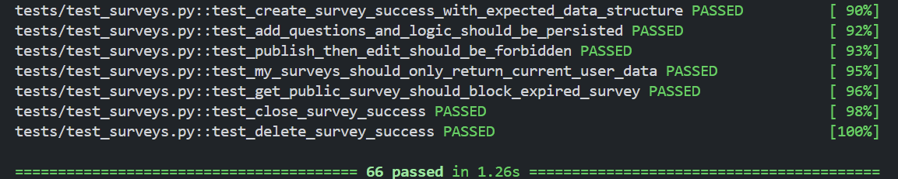

# 在线问卷系统项目完成报告（第二阶段）

## 1. 项目目标

本项目第二阶段在第一阶段基础上，根据用户反馈的8项新需求，对系统进行架构升级与功能扩展。

### 1.1 核心目标

- **题目独立实体化**：从第一阶段的"题目仅属于单个问卷"升级为"题目作为独立实体，可被多个问卷共享引用"
- **版本管理体系**：每道题目支持完整的版本链（v1 → v2 → v3 可能有分支），保留修改历史，支持恢复旧版本
- **权限与协作**：支持题目共享给其他用户，共享接收者可引用、可创建新版本但不能直接修改
- **题库管理**：用户可将常用题目加入个人题库，方便快速选题
- **跨问卷统计**：同一题在多个问卷中使用时，支持按版本汇总查看数据（如"年龄题"的总体分布）
- **历史数据保护**：已发布或已关闭问卷引用的版本自动冻结，禁止删除或原地修改，确保历史数据完整性

### 1.2 第二阶段新增需求覆盖

| #   | 需求             | 实现方式                                          |
| --- | ---------------- | ------------------------------------------------- |
| 1   | **题目复用**     | 独立题目实体 + 多问卷引用                         |
| 2   | **题目共享**     | `access_control.shared_with` 权限机制            |
| 3   | **版本管理**     | `versions[]` 数组 + `version_number` 链           |
| 4   | **修改历史**     | `parent_version_number` 追踪版本来源            |
| 5   | **版本共存**     | 多问卷指向同题的不同 `version_number`            |
| 6   | **使用反查**     | 索引支持反查"哪些问卷引用了这道题"               |
| 7   | **题库管理**     | `access_control.banked_by` + `$addToSet` 幂等   |
| 8   | **跨问卷统计**   | `answers` 中补齐 `question_ref_id` + `version_number` |


---

## 2. 原方案回顾与变更动因

### 2.1 第一阶段设计回顾

第一阶段采用**内嵌式文档建模**，数据库由 `users`、`surveys`、`responses` 三个集合组成：

| 集合          | 角色     | 核心字段                                                     |
| ------------- | -------- | ------------------------------------------------------------ |
| **users**     | 用户账户 | `_id`, `username`（唯一）, `password_hash`, `created_at`     |
| **surveys**   | 问卷     | `_id`, `title`, `creator_id`, `status`, `access_code`（唯一）, `response_count`, **`questions[]`（直接内嵌）** |
| **responses** | 答卷记录 | `_id`, `survey_id`, `respondent_id`, `is_anonymous`, `submitted_at`, **`answers[]`（直接内嵌）** |

这种设计的核心假设是**"题目只属于单个问卷，一旦创建就终身绑定"**，优势在于查询高效（一次查询返回全部题目）、更新原子（题目与问卷绑定更新）、Schema 简洁。

### 2.2 新需求暴露的结构性问题

通过分析用户的新增需求，我们发现第二阶段的核心需求是**让题目从"一次性、问卷私属"升级为"可复用、可共享、有版本"**，原有"题目从属于单问卷"的前提不再成立：

| #    | 新需求           | 第一阶段症状                 | 根本原因                                         |
| ---- | ---------------- | ---------------------------- | ------------------------------------------------ |
| 1    | **题目复用**     | 每次重新输入                 | 题目嵌在问卷内，无法跨问卷引用                   |
| 2    | **题目共享**     | 只能手动复制粘贴             | 无独立实体，无法挂载权限                         |
| 3    | **版本管理**     | 没有版本概念                 | 修改即覆盖，无法追踪历史                         |
| 4    | **版本共存**     | 一题多版本无法并存           | 每个问卷持有独立副本，无法指向同一实体的不同版本 |
| 5    | **使用追踪**     | 无法查询"哪些问卷用了这道题" | 题目没有全局 ID，无法建立反向索引                |
| 6    | **题库管理**     | 不支持题库概念               | 题目不独立存在，无处挂载"收藏"标记               |
| 7    | **跨问卷统计**   | 系统无法识别"同一题"         | 不同问卷中的同一题是不同副本，无共同标识         |

这些问题都指向同一个根源：**题目缺乏独立身份**。因此本次修改的核心是**把题目从问卷的附属品提升为独立实体**，再由问卷去引用这个实体的具体版本。

---

## 3. MongoDB 设计与调整

MongoDB 的设计变更是实现新增功能的基础，具体的数据库设计也可见代码仓库中的 **数据库设计.md** 文档。

第二阶段数据库最核心的变化是：**新增独立的 `questions` 集合**，并**将问卷与答卷中的题目从"直接嵌入内容"改为"存引用 id + 版本号"**

### 3.1 新增 `questions` 集合（内嵌版本模式）

```json
{
  "_id": ObjectId,
  "latest_version_number": Number,
  "access_control": {
    "creator": String,
    "shared_with": [String],
    "banked_by": [String]
  },
  "versions": [
    {
      "version_number": Number,
      "created_at": DateTime,
      "updated_by": String,
      "parent_version_number": Number / null,
      "type": String,
      "title": String,
      "required": Boolean,
      "options": [{"option_id": String, "text": String}],
      "validation": {}
    }
  ]
}
```

设计要点：

- **版本链管理**
  - 使用**内嵌版本模式**（Embedded Versioning Pattern），新增版本时 `$push` 到数组，通过 `$inc` 原子递增版本号，保证并发安全；
  - 版本一旦写入**不可修改、不可删除**，保证已发布问卷引用版本的数据完整性；
  - 通过 `parent_version_number` 追踪版本来源，恢复旧版本时创建新版本而不是覆盖原版本。

- **权限与题库**
  - 权限字段 `access_control` 挂在最外层，一次查询即可同时拿到权限信息和全部版本历史；
  - 题库管理基于 `banked_by` 数组实现：加入题库用 `$addToSet`，移除用 `$pull`，查询用 `find({"access_control.banked_by": user_id})`。

索引：

- `access_control.creator`（查询“我创建的题目”）
- `access_control.shared_with`（多键索引，查询“共享给我的题目”）
- `access_control.banked_by`（多键索引，查询“我的题库”）

### 3.2 `surveys.questions` 的引用化改造

**第一阶段（嵌入格式）：**

```json
{
  "questions": [
    {
      "question_id": "q1",
      "type": "single_choice",
      "title": "题目文本",
      "options": [...],
      "validation": {...},
      "logic": {...}
    }
  ]
}
```

**第二阶段（引用格式）：**

```json
{
  "questions": [
    {
      "question_id": "q1",
      "order": 1,
      "logic": {...},
      "question_ref_id": ObjectId,
      "version_number": 1
    }
  ]
}
```

变化说明：

- **内容与引用分离**：题目内容字段（type、title、options、validation）不再直接保存在问卷中，而是改为通过 `question_ref_id + version_number` 进行引用；
- **保留问卷级字段**：`question_id`、`order`、`logic` 等仍保留在问卷内，因为它们属于问卷本身的展示与跳转信息；
- **新增反查能力**：通过 `questions.question_ref_id` 索引，系统可以快速查询“哪些问卷引用了某道题”。

### 3.3 `responses.answers` 的引用补齐

**第一阶段：**

```json
{
  "answers": [{ "question_id": "q1", "answer": "opt1" }]
}
```

**第二阶段：**

```json
{
  "answers": [
    {
      "question_id": "q1",
      "question_ref_id": ObjectId,
      "version_number": 1,
      "answer": "opt1"
    }
  ]
}
```

变化说明：

- **新增引用追踪**：答案中补齐 `question_ref_id` 和 `version_number`，从而支持跨问卷、跨版本的数据聚合；
- **保留兼容字段**：`question_id` 和 `answer` 保持不变，保证第一阶段的答卷业务语义仍然可延续；
- **新增聚合索引**：`answers.question_ref_id` 用于加速跨问卷统计。

### 3.4 其他集合与总体权衡

`users` 集合结构和索引与第一阶段保持完全一致，无需修改。

从整体上看，第二阶段从“嵌入”切换到“引用”，虽然带来了多一次批量查询的成本，但显著增强了题目复用、版本管理、共享协作、使用追踪和跨问卷统计能力。

| 维度          | 嵌入（第一阶段） | 引用（第二阶段）                          | 权衡             |
| ------------- | ---------------- | ----------------------------------------- | ---------------- |
| 查询问卷+题目 | 1 次查询         | 2 次查询                                  | 多 1 次批量查询  |
| 跨问卷统计    | 扫描所有 survey  | 按 `answer.question_ref_id` 聚合          | ✅ 性能大幅提升   |
| 反查使用情况  | 扫描所有 survey  | 查索引 `survey.questions.question_ref_id` | ✅ 追踪能力增强   |
| 题目共享      | 每问卷一份副本   | 共享同一实体                              | ✅ 零冗余         |
| 数据一致性    | 自包含无依赖     | 依赖版本不变                              | ⚠️ 需版本保护机制 |

---

## 4. 系统设计与程序调整

系统整体架构（React + FastAPI + MongoDB）与第一阶段保持一致。本节说明程序层面为适配新数据结构所做的具体调整。

具体新功能对应的业务逻辑实践可见代码仓库的 **关键逻辑说明.md** 文档

### 4.1 架构总览

```
前端（React）
  ├── Dashboard              [update] 新增"题目管理"入口
  ├── SurveyEditor           [update] 支持从"我的题目/共享题目/题库"选题，支持版本切换
  ├── SurveyFill             问卷填写体验与第一阶段无差异
  ├── StatisticsView         [update] 新增"跨问卷统计"视图
  └── QuestionManager        [new] 题目生命周期管理（创建/共享/版本/题库）

后端（FastAPI）
  ├── routes/auth.py                   不变
  ├── routes/surveys.py                [update] 保存与读取改为引用解析模式
  ├── routes/responses.py              [update] 提交时补齐 question_ref_id 和 version_number
  ├── routes/statistics.py             [update] 新增跨问卷统计接口
  ├── routes/questions.py              [new] 题目管理路由
  │
  ├── services/auth_service.py         不变
  ├── services/survey_service.py       [update] 改造为引用模式（读写时自动解析）
  ├── services/response_service.py     [update] 改造为引用模式（提交时补齐引用信息）
  ├── services/statistics_service.py   [update] 新增跨问卷统计聚合
  ├── services/question_service.py     [new] 题目业务管理
  │
  ├── models/user.py / survey.py / response.py  不变
  └── models/question.py               [new] 题目与版本相关 Pydantic 模型

支撑层（迁移、测试）
  ├── scripts/migrate_phase2.py        [new] 数据迁移脚本（存量数据一次性转为引用格式）
  └── tests/                           [update] 保留第一阶段测试，新增题目管理等20个测试
```

注： `[update]` 表示在第一阶段基础上改造，`[new]` 表示第二阶段新增，其余与第一阶段保持不变。

### 4.2 后端服务与路由调整

后端新增文件如下：

| 文件                                       | 说明                                                         |
| ------------------------------------------ | ------------------------------------------------------------ |
| `backend/app/services/question_service.py` | 题目域业务逻辑，包含创建题目、查询列表、查看详情、创建新版本、版本历史、恢复版本、共享/取消共享、题库管理、使用情况查询、删除题目等函数 |
| `backend/app/routes/questions.py`          | 题目管理 API 路由，注册所有题目相关端点（POST /questions、GET /questions/my、GET /questions/shared、GET /questions/banked 等） |
| `backend/app/models/question.py`           | 题目相关 Pydantic 模型（QuestionCreateRequest、QuestionNewVersionRequest、QuestionShareRequest 等） |
| `backend/scripts/migrate_phase2.py`        | 一次性数据迁移脚本                                           |
| `backend/tests/test_questions.py`          | 题目域测试用例                                               |

后端重构文件如下：

| 文件                                         | 改造内容                                                     |
| -------------------------------------------- | ------------------------------------------------------------ |
| `backend/app/services/survey_service.py`     | 问卷保存/读取改为引用模式；保存时校验引用有效性和权限；读取时批量解析引用补全题目内容；发布校验基于解析后内容 |
| `backend/app/services/response_service.py`   | 提交答卷前解析问卷引用获取题目内容；校验、跳转、必填判断基于解析后内容；写入时自动补齐 `question_ref_id` 和 `version_number` |
| `backend/app/services/statistics_service.py` | 按问卷统计改用解析后题目；新增跨问卷单题统计（按 `question_ref_id` 聚合，按 `version_number` 分组） |
| `backend/app/routes/surveys.py`              | 适配问卷服务改造                                             |
| `backend/app/routes/responses.py`            | 适配答卷服务改造                                             |
| `backend/app/routes/statistics.py`           | 新增跨问卷统计端点                                           |
| `backend/app/database.py`                    | 新增 `questions` 集合索引初始化                              |
| `backend/app/main.py`                        | 注册 `questions` 路由                                        |

其中几个关键变化如下：

- **题目管理服务**：负责创建题目、共享/取消共享、加入/移出题库、查看使用情况、版本历史与恢复等能力；
- **问卷服务**：保存时校验引用合法性，读取时批量解析 `question_ref_id + version_number`，再补全为前端可直接消费的完整题目对象；
- **答卷服务**：提交前先解析题目版本内容，再执行必填、答案有效性和跳转逻辑计算，最后自动补齐引用字段后写入；
- **统计服务**：在保留原有按问卷统计逻辑的基础上，新增按 `question_ref_id` 和 `version_number` 聚合的跨问卷统计。

### 4.3 前端组件与交互调整

前端新增文件如下：

| 文件                                          | 说明                                                         |
| --------------------------------------------- | ------------------------------------------------------------ |
| `frontend/src/components/QuestionManager.tsx` | 题目管理组件，支持“我的题目”/“共享给我”/“我的题库”三标签页，包含新建题目、版本管理、共享管理、题库管理、使用情况、跨问卷统计等完整功能 |

前端重构文件如下：

| 文件                                         | 改造内容                                                     |
| -------------------------------------------- | ------------------------------------------------------------ |
| `frontend/src/components/SurveyEditor.tsx`   | 题目列表改为引用格式；支持从“我的题目”/“共享给我”/“我的题库”选题；支持查看和替换引用版本 |
| `frontend/src/components/StatisticsView.tsx` | 增加跨问卷统计视图                                           |
| `frontend/src/components/Dashboard.tsx`      | 增加题目管理入口                                             |
| `frontend/src/types/index.ts`                | 新增题目谱系、版本、引用项、使用关系、跨问卷统计等类型定义   |
| `frontend/src/services/api.ts`               | 新增题目相关 API 调用函数                                    |

其中，`QuestionManager.tsx` 提供“我的题目 / 共享给我 / 我的题库”三维视图，并支持以下能力：

- **版本编辑智能判断**：
  - 最新版本仅被草稿问卷引用 → 可选择“修改当前版本”或“创建新版本”；
  - 最新版本被已发布/已关闭问卷引用 → 仅允许“创建新版本”；
  - 共享接收者 → 禁止原地修改，仅允许“创建新版本”。
- **题目使用追踪**：显示使用计数，并查看引用该题的问卷及版本分布；
- **跨问卷统计**：提供单题跨问卷汇总统计入口；
- **题库防重**：前端维护 `bankedRefIds` 集合，结合后端 `$addToSet` 实现加入题库的幂等防重。

而 `SurveyEditor.tsx` 的核心变化，则是将问卷编辑时维护的题目数据改为引用格式，并支持从“我的题目 / 共享给我 / 我的题库”中直接选题、加入题库和切换题目版本。

### 4.4 数据迁移与前后端协同流程

由于底层数据表示方式发生了变化，程序层面还需要补充迁移脚本和协同流程，确保新结构可以平稳落地。

`backend/scripts/migrate_phase2.py` 实现的一次性迁移步骤如下：

1. 遍历所有问卷，从 `surveys.questions` 中抽取内嵌题目；
2. 为每个题目在 `questions` 集合中创建独立文档（版本 v1），建立 `question_id → question_ref_id` 映射；
3. 更新问卷的 `questions` 数组为引用格式（保留 `question_id`、`order`、`logic`，新增 `question_ref_id` 和 `version_number`）；
4. 更新该问卷所有答卷的 `answers`，补齐 `question_ref_id` 和 `version_number`；
5. 通过检查题目是否已有 `question_ref_id` 保证迁移幂等，避免重复处理。

在实际运行时，前后端配合也围绕“先引用、再解析”的思路进行：

- **编辑问卷时**：前端先调用 `/questions/my`、`/questions/shared`、`/questions/banked` 拉取可选题目，再把选中的 `question_ref_id + version_number` 写入问卷；
- **查看/填写问卷时**：后端读取问卷后批量解析题目引用，返回与第一阶段一致的完整题目内容，前端填写页无需感知内部结构变化；
- **提交答卷时**：后端先按引用解析题目版本，再执行校验与跳转，并在落库时自动补齐题目引用字段；
- **编辑题目版本时**：后端根据题目创建者身份和该版本是否被已发布/已关闭问卷引用，决定前端应显示“修改当前版本”还是“创建新版本”。

---

## 5. 兼容性与功能验证

不过，系统在重构过程中不仅要实现新功能，还必须考虑与原有功能之间的衔接关系。因此，除了完成新架构设计和程序改造之外，还需要回答两个问题：一是重构过程中是否遇到了兼容性风险，二是如何证明第一阶段旧功能仍然可用。

### 5.1 是否遇到兼容性问题，以及如何处理

从最终结果看，**没有出现无法兼容第一阶段功能的结构性问题**。这一点并不是因为第二阶段“完全没有变化”，而是因为项目在设计和实现时提前构建了三层兼容性保障机制，使内部结构的变化不会直接影响旧功能。

#### （1）存量数据迁移：一次性转换

项目采用**一次性迁移策略**，而不是长期维护“内嵌结构 + 引用结构”双轨并存的代码。迁移脚本 `backend/scripts/migrate_phase2.py` 会将第一阶段存量问卷和答卷统一转换为第二阶段引用格式：

- 遍历每个问卷，从原内嵌 `questions[]` 中抽取题目，在 `questions` 集合中创建对应文档（v1 版本）；
- 更新问卷和答卷中的题目字段，使其补齐 `question_ref_id` 和 `version_number`；
- 迁移具有幂等性，多次运行不会产生重复数据。

这种做法避免了系统长期维护双结构代码的复杂度，也降低了后续业务逻辑分叉的风险。

#### （2）后端引用解析：屏蔽结构变更

虽然底层存储已经改为引用模式，但后端加入了**引用解析层**，从而对前端屏蔽内部结构差异：

- **问卷读取时**：后端先读取问卷中的题目引用，再批量查询 `questions` 集合并提取指定版本内容，最后合并为完整题目对象返回前端；
- **答卷提交时**：后端先按引用解析题目版本，再执行必填、答案有效性与跳转逻辑校验，最后自动补齐引用字段落库。

因此，前端 `SurveyFill.tsx` 最终接收到的仍然是与第一阶段一致的完整题目内容，请求体格式也保持不变，填写体验和原有业务逻辑都无需重写。

#### （3）测试框架适配：保障验证可持续

第一阶段已有 46 个测试，它们创建问卷时使用的还是旧的内嵌题目结构。为了让这些测试在第二阶段继续有效，测试框架进行了最小必要适配：

- 在 `backend/tests/conftest.py` 中实现 `convert_to_refs()`，将旧格式题目自动转换为引用格式；
- 扩展 FakeDB 能力，使其支持 `$inc`、`$push`、`$addToSet`、`$pull`、dot-notation、`$in`、`delete_one()` 等第二阶段需要的行为；
- 保证旧测试的业务断言部分基本不变，从而继续验证第一阶段能力是否仍然成立。

### 5.2 如何保证旧功能仍然可用

针对上述兼容性风险，项目采取了迁移、解析和测试三层保障机制，并通过自动化验证证明旧功能并未因为第二阶段重构而失效。

#### （1）测试验证总结

通过兼容性保障机制，完整的测试套件验证了第二阶段的正确性和兼容性：

- **第一阶段测试**：46 个测试全部通过（通过 `convert_to_refs()` 适配引用格式）；
- **第二阶段测试**：新增 20 个测试验证题目管理、版本控制、权限、统计等新功能；
- **合计**：66 个测试全部通过，覆盖从基础认证到复杂统计的全业务链路。

#### （2）功能需求验证矩阵

对照八项用户需求，第二阶段的实现方式及验证方法如下：

| #    | 需求             | 第二阶段实现方式                                 | 验证方法                                 |
| ---- | ---------------- | ------------------------------------------------ | ---------------------------------------- |
| 1    | **题目复用**     | 独立题目实体 + 多问卷引用                        | test_questions.py 中的创建和列表查询测试 |
| 2    | **题目共享**     | access_control.shared_with 权限机制              | 权限校验测试 + 共享后的跨用户访问验证    |
| 3    | **版本管理**     | versions[] 数组 + version_number 链              | 版本创建、历史查询、恢复测试             |
| 4    | **避免版本冲突** | 引用指向具体版本号                               | 不同问卷引用同题不同版本的并存测试       |
| 5    | **版本共存**     | 多问卷指向 question_ref_id 的不同 version_number | 版本并存测试验证统计时按版本分组         |
| 6    | **使用追踪**     | 反查索引 surveys.questions.question_ref_id       | 使用情况查询 API 测试                    |
| 7    | **题库管理**     | access_control.banked_by + $addToSet 幂等操作    | 加入/移出题库、防重测试                  |
| 8    | **跨问卷统计**   | answers 中的 question_ref_id + version_number    | 跨问卷单题统计聚合查询测试               |

**验证结论**：八项新增需求都通过了对应的自动化测试，功能完整性得到验证。

#### （3）数据一致性验证

迁移前后的数据一致性则通过以下方式进行确认：

- **迁移脚本验证**：保留迁移前后的问卷与答卷数据快照，并通过解析引用逆向重建原数据，对比二者一致；
- **业务逻辑验证**：问卷仍保留 `question_id` 和 `logic`，答卷仍保留 `question_id` 和 `answer`，统计结果在迁移前后保持一致；
- **幂等性验证**：迁移脚本支持重复执行，已迁移数据会被自动识别并跳过，避免重复迁移导致冲突。

#### （4）三层保障机制的整体效果

综合来看，项目通过以下三层机制保证了旧功能的可用性：

| 保障层     | 机制         | 验证方式            | 结果                        |
| ---------- | ------------ | ------------------- | --------------------------- |
| **数据层** | 一次性迁移   | 数据一致性验证      | ✅ 存量数据完全转换，无丢失  |
| **逻辑层** | 后端解析层   | 问卷/答卷兼容性验证 | ✅ 前端无感知，业务逻辑不变  |
| **验证层** | 测试框架适配 | 自动化测试结果      | ✅ 66 个测试通过，覆盖全链路 |

**最终结论**：第二阶段虽然对数据模型和程序结构进行了较大重构，但通过迁移脚本、后端解析层和测试框架适配三项机制，系统成功保留了第一阶段旧功能的可用性。用户和前端开发者无需感知底层架构变化，即可平滑使用升级后的系统。

---

## 6. AI使用过程

本项目第二阶段使用了**Claude Code**、**GitHub Copilot** 等 AI 工具，以及 Claude Opus 4.6、Claude Sonnet 4.6 等模型，贯穿整个开发周期。

### 6.1 AI主要帮助

- **数据库方案初版设计**（log#1-3）
  
  AI 根据第二阶段 8 个新需求直接产出了”新增 questions 集合、surveys/responses 改为引用格式”的初版方案，并给出了题库基于 `banked_by` 数组实现的建议。**显著降低了从 0 到 1 的设计成本**。

- **前端题目管理组件生成**（log#4, 6, 8-10）
  
  根据需求快速生成了 QuestionManager.tsx 的框架与核心逻辑、版本编辑流程、跨问卷统计卡片等组件，大幅加快了前端开发效率。

- **后端题目服务快速搭建**（log#11, 17）
  
  生成了 question_service.py 的大部分业务逻辑初稿，包含创建题目、查询列表、版本管理、权限校验等函数框架，以及模型定义与路由注册。

- **测试框架扩展与补强**（log#14）
  
  当后端引入新的 MongoDB 操作符（`$elemMatch`、数组下标路径）后，AI 快速补全了 FakeDB 测试框架的支持，避免了手工调试测试框架的时间消耗。

### 6.2 AI做错了什么

- **log#5：题目数据来源混淆**
  
  AI 在完成题目管理后，题目管理页的”我的题库”标签页误用了 `getMyQuestions()`（按 creator 查询）而非 `getBankedQuestions()`（按 banked_by 查询），导致用户每次在编辑问卷添加新题目后，题目管理里会多出那个题目。

- **log#13：序号混乱问题**
  
  AI 生成的选项 ID 采用简单计数（`opt${index}`）而非时间戳+随机数，当删除某个选项再添加新选项时会产生 ID 重复，导致 React key 冲突与渲染错乱（修改一个选项时另一个也跟着变）。

- **log#14：测试桩参数不匹配**
  
  后端新增了 `find(filter, projection)` 调用，但测试桩的 `FakeCollection.find()` 只支持 1 个参数，直接导致 8 个测试失败，需后续修复框架。

### 6.3 自己改了什么

- **数据来源语义校正**（log#15）
  
  明确了”我的题目”应表示**用户创建的全部题目**（包含已入库和未入库），而不等同于”我的题库”。同步调整了前后端的查询逻辑。

- **题库语义区分**（log#18）
  
  在”我的题库”标签下改为”移出题库”（仅调用 removeFromBank），而”我的题目”标签下保留”删除题目”（调用 deleteQuestion）的语义，避免混淆。

- **清理未使用的 TypeScript 类型**（log#18）
  
  移除了 QuestionManager.tsx 中未使用的类型导入（CreateQuestionRequest、CreateVersionRequest）和常量（TYPE_ICON）。

- **前端防重机制完善**（log#12）
  
  将 `bankedQids`（按问卷内局部 id）改为 `bankedRefIds`（按全局 question_ref_id），支持统一的防重判断逻辑。

### 6.4 自己设计了什么

- **版本冻结保护机制**
  
  被已发布/已关闭问卷引用的版本自动冻结，禁止原地修改，仅允许创建新版本。通过后端查询判断版本的使用情况，前端根据情况展示”修改”或”创建新版本”的选项。

- **共享接收者权限边界**
  
  共享接收者可以查看、引用、创建新版本，但禁止直接修改已有版本内容。这确保了版本链的数据完整性，避免共享接收者破坏原始版本。

- **`bankedRefIds` 前端防重机制**
  
  前端维护一个 Set 追踪已加入题库的题目 ID，加载列表时同步拉取题库数据，点击”加入题库”后立即反映到 UI（显示”✅ 已添加入题库”），天然幂等，无重复加入风险。

- **版本决策树的前端实现**
  
  根据版本的使用情况自动判断，未被已发布问卷引用时显示”修改/创建”二选一，否则仅显示”创建新版本”，减少用户误操作。

---

## 7. 测试

本阶段采用**自动化 API 测试** + **手工测试**相结合的方式，共 66 个测试全部通过。

### 7.1 自动化测试

运行命令：`cd backend && python -m pytest tests/ -v`

| 测试文件                | 数量 | 说明                                 |
| ----------------------- | ---- | ------------------------------------ |
| test_auth.py            | 14   | 用户认证（第一阶段，无修改）         |
| test_surveys.py         | 6    | 问卷管理（第二阶段适配引用格式）     |
| test_responses.py       | 13   | 答卷提交与校验（第二阶段适配）       |
| test_statistics.py      | 2    | 统计分析（第二阶段适配）             |
| test_jump_validation.py | 11   | 跳转逻辑验证（第二阶段适配）         |
| test_questions.py       | 20   | 题目域测试（第二阶段新增）           |
| **合计**                | **66** | **全部通过**                         |

第二阶段新增的 20 个题目测试覆盖：题目创建与列表查询、版本管理（创建/历史/恢复）、权限控制（共享/取消/题库）、使用追踪、版本冻结保护（草稿允许修改/已发布禁止/已关闭禁止/可创建新版本）、共享者权限限制、题库防重、版本并存。



### 7.2 遇到的问题与解决

#### 修复项一：题目管理"我的题库"多出多余条目

**问题**：编辑问卷添加新题目后，题目管理的"我的题库"标签页多出该题目。
**原因**：AI 初版代码中"我的题库"tab 误用 `getMyQuestions()`（按 creator 查询）而非 `getBankedQuestions()`（按 banked_by 查询）。
**修复**：QuestionManager.tsx 中"我的题库"tab 改用 `getBankedQuestions()`。

#### 修复项二：编辑问卷题目序号混乱

**问题**：删除题目再添加新题目，导致题号重复、修改一个题目时另一个也变化。
**原因**：`question_id` 采用简单计数 `` `q${order}` ``，删除后再添加会产生 ID 重复，React key 冲突导致组件状态混乱。
**修复**：SurveyEditor.tsx 中 `question_id` 改为时间戳+随机数：`` `q_${Date.now()}_${Math.random().toString(36).slice(2, 6)}` ``。

#### 修复项三：测试桩参数数量报错

**问题**：8 个测试失败，报错 `FakeCollection.find() takes from 1 to 2 positional arguments but 3 were given`。
**原因**：后端新增 `find(filter, projection)` 调用，FakeDB 只支持单参数。
**修复**：扩展 `FakeCollection.find()` 支持 `projection` 参数，新增 `$elemMatch` 操作符和数组下标路径读写能力。

#### 修复项四：版本切换后误判为"被修改"

**问题**：题目管理页切换版本后，编辑器误判题目被修改，自动创建新版本。
**原因**：`switchVersion` 切换版本后没有同步更新 `originalContent` 快照。
**修复**：SurveyEditor.tsx 中切换版本后立即更新 `originalContent` 为新版本内容。

---

## 8. 总结与分工

本项目第二阶段成功完成了从”题目内嵌模式”向”独立题目实体 + 版本管理”的架构升级，实现了题目复用、共享、版本管理、题库、跨问卷统计等 8 项新需求，同时通过后端引用解析层和数据迁移脚本保证了对第一阶段功能的完全兼容。

### 核心成就

- **架构设计**：题目独立实体化，采用内嵌版本模式，支持并发安全的版本号生成
- **权限体系**：明确的共享与编辑边界，版本冻结保护机制
- **向后兼容**：一次性迁移策略 + 后端引用解析层，前端完全无感知
- **验证覆盖**：66 个自动化测试全部通过，包含 46 个第一阶段兼容测试和 20 个新功能测试

### 分工与协作

- **共同设计**：新数据库方案（questions 集合、引用格式改造、权限模型）
- **吴晨曦**：完成初步需求更新，包含后端服务层新增/改造（question_service.py、survey_service.py 改造）、前端组件开发（QuestionManager、SurveyEditor 改造）、数据迁移脚本
- **丁熙妍**：在此基础上进行测试修正、代码优化、性能调优、完整文档编写


第二阶段代码与相关内容在代码仓库的phase2分支：https://github.com/wcxxx57/db-project1/tree/phase2

