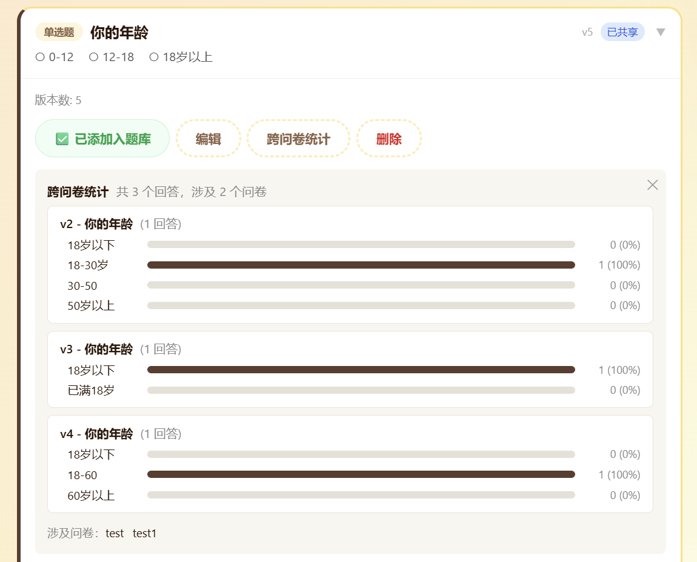
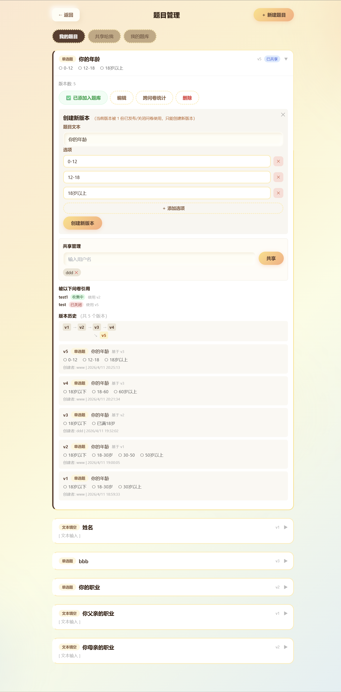
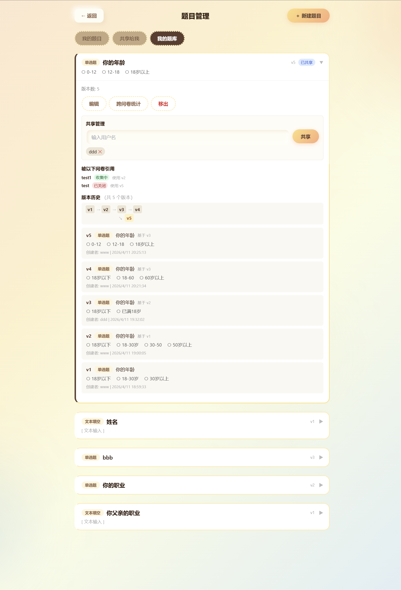
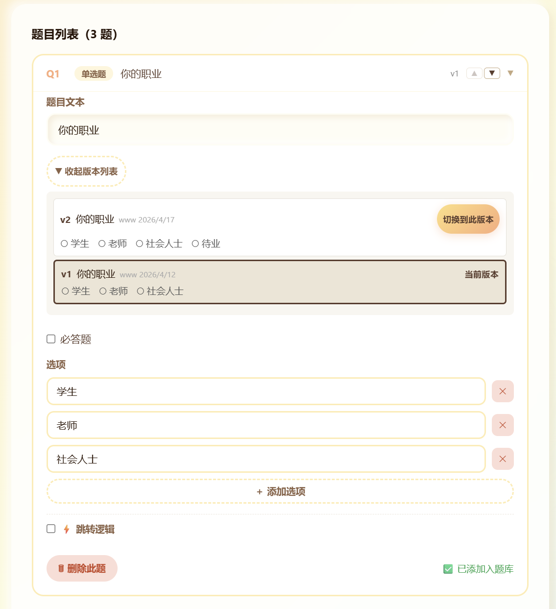

# 项目完成报告（第二阶段）

## 1. 第一阶段的设计是什么

第一阶段系统采用前后端分离架构（React + Vite + TypeScript 前端，FastAPI 后端，MongoDB 数据库），核心采用了**内嵌式文档建模**的设计思想。

### 1.1 数据模型概览

系统运用三个集合：

| 集合          | 角色       | 核心字段                                                                                                                                             |
| ------------- | ---------- | ---------------------------------------------------------------------------------------------------------------------------------------------------- |
| **users**     | 用户账户   | `_id`, `username`（唯一）, `password_hash`, `created_at`                                                                                             |
| **surveys**   | 问卷聚合根 | `_id`, `title`, `creator_id`, `status`（draft/published/closed）, `access_code`（唯一）, `response_count`（冗余计数）, **`questions[]`（直接内嵌）** |
| **responses** | 答卷记录   | `_id`, `survey_id`, `respondent_id`, `is_anonymous`, `submitted_at`, **`answers[]`（直接内嵌）**                                                     |

关键特征：**题目直接嵌入问卷、答案直接嵌入答卷**。一次查询即可获取完整数据，避免了关系型数据库的 JOIN 开销。

### 1.2 设计特征：题目的生命周期依附于问卷

第一阶段最核心的假设是：**"题目只属于单个问卷，一旦创建就终身绑定"**。

这个假设带来的**设计优势**：

- 查询高效：获取问卷时一次查询返回全部题目及其定义；
- 更新原子：题目与问卷绑定更新，不存在不一致风险；
- Schema 简洁：逻辑清晰，数据结构直观。

支持的**核心功能**：

- **跳转引擎**：数据驱动的条件分支（3种条件类型 × 2种动作类型），保存时执行三层校验（目标存在性、禁止向前跳转、DFS环路检测）；
- **校验引擎**：多选数量限制、文本字数限制、数字范围限制，采用双阶段校验管线；
- **匿名与重复提交控制**：通过 `settings` 字段灵活配置；
- **统计分析**：按问卷维度聚合，支持分题统计。

---

## 2. 新需求带来了哪些问题

第二阶段用户反馈了八项新需求（详见 `第二阶段需求变更.md`），核心诉求是：**让题目从"一次性、问卷私属"升级为"可复用、可共享、有版本"**。这些需求直指内嵌模式的根本局限。

## 2.1 问题梳理表

| #   | 需求             | 第一阶段症状                 | 为什么是问题                                     |
| --- | ---------------- | ---------------------------- | ------------------------------------------------ |
| 1   | **题目复用**     | 每次重新输入                 | 用户做类似问卷时重复劳动；无法从已有题目中选择   |
| 2   | **题目共享**     | 只能手动复制粘贴             | 团队无法通过系统协作；无权限机制                 |
| 3   | **版本管理**     | 没有版本概念                 | 修改后无法恢复；无法追踪"这个题是从哪个版本改的" |
| 4   | **避免版本冲突** | 内嵌模式无法支持             | 不同问卷需要同一题的不同版本，但每个副本独立     |
| 5   | **版本共存**     | 一题多版本无法并存           | 问卷A想用v1、问卷B想用v2，内嵌模式下做不到       |
| 6   | **使用追踪**     | 无法查询"哪些问卷用了这道题" | 修改题目时不知道影响范围                         |
| 7   | **题库管理**     | 不支持题库概念               | 常用题目无处整理；做新问卷时无快速选题机制       |
| 8   | **跨问卷统计**   | 系统无法识别"同一题"         | "年龄"在10个问卷里用过，无法看总体年龄分布       |

### 2.2 具体场景分析

#### 场景1：题目复用与数据一致性

用户A创建问卷"员工满意度调查"，第1题是"您的年龄"；用户A后来又要创建问卷"客户反馈"，也需要"您的年龄"。

第一阶段做法：
❌ 重新输入题目（低效）
❌ 或复制粘贴内容（容易出错，修改后互不影响）

期望：
✅ 从已有题目中选择，一键加入新问卷
✅ 修改题目时所有使用该题的问卷都能感知

#### 场景2：版本并存需求

问卷A发布时用的是"您的年龄？"这个题（v1）；问卷B希望用改进版本"请输入您当前的年龄"（v2）。

第一阶段限制：
❌ 两个问卷的题目是独立副本，没有版本关联
❌ 即使想共享同一题，也无法在版本间切换

第二阶段需求：
✅ 同一题的不同版本可以并存
✅ 问卷A保持引用v1、问卷B引用v2
✅ 统计时能按版本分别展示

#### 场景3：团队协作与权限

教师设计了一套标准题库（如"学生学习态度问卷"的5道题）；学生想在自己的课题问卷中复用这些题。

第一阶段做法：
❌ 学生手动复制粘贴（容易错、容易不一致）
❌ 教师重新创建副本（浪费时间、数据冗余）

第二阶段需求：
✅ 学生可以查看"教师共享给我的题库"
✅ 直接选题加入自己的问卷
✅ 教师修改题目v1→v2，学生可以选择升级使用

---

## 3. 为什么需要修改原设计

### 3.1 内嵌模式的根本矛盾

第一阶段的"题目嵌入问卷"设计通过**强绑定**实现了高效和一致性，但这个设计的成功恰恰源于一个核心假设："**题目只属于单个问卷**"。

新需求则打破了这个假设。当用户要求"题目可复用、可共享、有版本"时，本质上是在要求："**题目属于多个问卷**"。

两个需求在根本上产生了矛盾：

- **第一阶段的模型假设**：
  题目 ⊂ 问卷 （题目只属于一个问卷）

- **新需求的核心诉求**：
  题目 ∈ {多个问卷} （题目属于多个问卷）

这不是功能上的差异，而是架构基础的冲突：

> 内嵌模式下，题目的所有权、版本链、权限控制都依附于问卷。即使添加新功能也改变不了这个根本约束——题目的生命周期仍然完全依附于问卷。因此，必须进行**数据模型层面的结构性改造**，而不是在原有框架上打补丁。

### 3.2 为什么不能用"复制副本"来解决

最直接的想法是让用户从已有问卷复制题目到新问卷。但这只解决了"复用"，其他需求仍无法满足：

| 需求       | 复制方案    | 缺陷                           |
| ---------- | ----------- | ------------------------------ |
| 题目复用   | ✅ 可复制   | ✅ 满足                        |
| 题目共享   | ❌ 副本独立 | 修改后互不影响，无法真正"共享" |
| 使用追踪   | ❌ 无法追踪 | 系统不知道这些副本来自同一题   |
| 跨问卷统计 | ❌ 无法聚合 | 副本没有共同标识               |

**结论**：复制副本是"物理复制"，不是真正的"共享"。真正的共享需要多个使用者指向**同一个实体**，有**版本链**，且能引用**不同版本**。

### 3.3 解决方案：从嵌入升级为引用

要实现"一题多用"的完整需求，必须做出**架构级别的结构变更**：

**核心改变：题目从问卷的附属品提升为独立实体**

第一阶段：内嵌模式

```
┌─────────────┐
│ surveys     │
├─────────────┤
│ _id         │
│ questions[] │ ◀── 直接包含完整题目内容
│ ├─ q1: {...type, title, options, validation...}
│ ├─ q2: {...}
│ └─ q3: {...}
└─────────────┘
↑ 特点：一对一、无版本、无共享
```

第二阶段：引用模式

```
┌─────────────┐ ┌──────────────┐
│ surveys │ │ questions │◀── 新增独立集合
├─────────────┤ ├──────────────┤
│ _id │ │ _id │
│ questions[] │ ─────→ │ versions[] │
│ ├─ q1: {question_ref_id, version_number} │ ├─ v1: {...内容}
│ ├─ q2: {...} │ ├─ v2: {...内容}
│ └─ q3: {...} │ └─ v3: {...内容}
└─────────────┘ │ access_control
│ ├─ creator
│ ├─ shared_with[]
│ └─ banked_by[]
└──────────────┘
↑ 特点：一题多用、版本链、权限控制
```

**三个关键改变：**

1. **新增 `questions` 集合**：题目获得独立身份、版本链、权限管理
2. **问卷改为引用格式**：从"包含完整内容"改为"指向questions.\_id + version_number"
3. **答卷增加引用信息**：记录 `question_ref_id` 和 `version_number`，支持跨问卷统计

**这不是功能加法，而是架构变更**，涉及：

- ✏️ 数据库模型重构
- ✏️ 服务层业务逻辑重新设计（问卷读写、答卷提交、统计聚合）
- ✏️ 前端交互方式调整（题目管理界面、编辑器改造）
- ✏️ 存量数据迁移

---

## 4. 修改了哪些部分

### 4.1 数据层改造

#### （1）新增 `questions` 集合

- 题目提升为独立实体，拥有独立的生命周期管理
- 内部使用 `versions[]` 数组存储全部历史版本
- 顶层维护 `latest_version_number` 和 `access_control`（creator、shared_with、banked_by）
- 版本号通过 MongoDB `$inc` 原子递增，保证并发安全

#### （2）`surveys.questions` 改为引用格式

- 从存储完整题目内容改为存储：`question_ref_id`（指向 questions.\_id）+ `version_number`（具体版本号）
- 保留 `question_id`（问卷内局部题号，用于跳转路由）、`order`（显示顺序）、`logic`（问卷级跳转逻辑）
- 新增索引支持反查："这道题被哪些问卷使用"

#### （3）`responses.answers` 补充引用字段

- 每个答案新增 `question_ref_id` 和 `version_number`
- 支持按题目+版本维度聚合统计

### 4.2 后端服务层改造

#### （1）新增题目管理服务（`backend/app/services/question_service.py`）

- 创建题目（自动生成 v1 版本）
- 查询接口：我的题目 / 共享给我 / 我的题库（三个不同权限维度）
- 版本操作：创建新版本、查看版本历史、恢复旧版本
  - **版本原地编辑智能判断**：未被已发布/已关闭问卷引用时允许原地修改，被引用时仅允许创建新版本
  - **共享题目权限限制**：创建者可原地修改，共享接收者禁止原地修改（仅可创建新版本，403 + 错误码 2002）
- 权限操作：共享/取消共享、加入/移出题库
- 追踪功能：查看某题被哪些问卷使用
- 删除控制：权限校验 + 使用情况检查（被已发布/已关闭问卷引用时禁止删除）

#### （2）问卷服务改造（`backend/app/services/survey_service.py`）

- 保存问卷时：接收引用格式题目列表 → 校验引用有效性 + 权限
- 读取问卷时：批量查询 questions 集合 → 解析引用 → 补全题目完整内容返回前端
- 发布校验：基于已解析的题目版本内容执行跳转验证

#### （3）答卷服务改造（`backend/app/services/response_service.py`）

- 提交前：先解析问卷引用的题目版本获取完整内容
- 校验执行：必填判断、答案有效性、跳转计算全部基于解析后内容
- 写入时：自动补齐 `question_ref_id` 和 `version_number`

#### （4）统计服务升级（`backend/app/services/statistics_service.py`）

- 按问卷统计：保留原逻辑，改用解析后题目版本内容
- 新增跨问卷统计：按 `question_ref_id` 聚合 + 按 `version_number` 分组

### 4.3 前端改造

#### （1）新增题目管理界面（`frontend/src/components/QuestionManager.tsx`）

题目管理组件支持三维度视图，对应不同的访问权限和操作权限：

| 维度         | 题目来源               | 显示内容                     | 操作按钮                                  |
| ------------ | ---------------------- | ---------------------------- | ----------------------------------------- |
| **我的题目** | 当前用户创建的全部题目 | 标题、类型、版本号、使用计数 | ✏️ 编辑 / 📥 加入题库 / 🔗 共享 / 🗑️ 删除 |
| **共享给我** | 其他用户共享的题目     | 标题、类型、版本号、创建者   | ✏️ 编辑 / 📥 加入题库                     |
| **我的题库** | 用户收藏的题目         | 标题、类型、版本号、创建者   | ✏️ 编辑 / ✗ 移出题库                      |

**防重机制**：前端维护 `bankedRefIds` Set 追踪已加入题库的题目。加载三类列表时同时拉取题库数据，"加入题库"点击后立即失效变为"✅ 已添加入题库"。后端 `$addToSet` 保证幂等性。

**基于三维度视图，衍生以下核心功能：**

- **版本编辑智能判断**：
  - 最新版本仅被草稿问卷引用 → "✏️ 修改当前版本" 或 "＋ 创建新版本"二选一
  - 最新版本被已发布/已关闭问卷引用 → 仅允许"创建新版本"
  - 共享接收者 → 禁止原地修改，仅允许"创建新版本"

- **题目使用追踪**：

  显示使用计数，点击可查看哪些问卷引用了该题及其版本分布。

- **跨问卷统计**：

  新增"📈 跨问卷统计"按钮，查看该题在所有问卷中的汇总数据（按版本分组）。

  

**前端界面展示：**

- **我的题目标签页**

  

- **共享给我标签页**

  

- **我的题库标签页**

  

#### （2）编辑器改造（`frontend/src/components/SurveyEditor.tsx`）

- 题目列表改为维护引用格式（question_ref_id + version_number）
- 新增"从我的题目/题库/共享题目选题"对话框

  

- 新增"📥 加入题库"按钮 / "✅ 已添加入题库"（防重机制）按钮，支持快速收藏常用题目

  

- 支持"替换版本"功能：选择该题的其他可用版本替换当前版本

  

#### （3）其他前端调整

- `StatisticsView.tsx`：增加跨问卷统计视图入口
- `Dashboard.tsx`：增加题目管理页面导航
- `types/index.ts`：新增题目相关类型定义（题目谱系、版本、引用、使用关系等）
- `services/api.ts`：新增题目管理相关 API 调用函数

### 4.4 数据迁移脚本（`backend/scripts/migrate_phase2.py`）

一次性迁移脚本将第一阶段存量数据统一转换为引用格式：

遍历问卷从内嵌题目创建 `questions` 集合文档（v1版本），更新问卷和答卷为引用格式，幂等性检查通过 `question_ref_id` 判断是否已迁移。

### 4.5 新增测试用例

新增 `backend/tests/test_questions.py` 文件，包含题目域的完整测试覆盖：

**核心测试场景：**

- 题目创建与列表查询（我的题目 / 共享给我 / 我的题库）
- 版本管理（创建新版本、版本历史、恢复旧版本）
- 权限控制（共享、取消共享、加入题库、移出题库）
- 题目追踪（查看使用情况、删除权限控制）
- **版本保护机制**：
  - 仅被草稿问卷引用时允许原地修改版本
  - 被已发布/已关闭问卷引用时禁止原地修改，需创建新版本
- **共享题目权限限制**：
  - 共享接收者禁止原地修改，仅可创建新版本
- **题库防重**：`$addToSet` 幂等保证
- 版本并存（不同问卷引用同一题目的不同版本）

**兼容性验证：**

- 第一阶段 46 个测试全部通过（通过 `convert_to_refs()` 适配引用格式）
- 新增的 20 个测试与旧测试，合计 66 个测试全部通过

这确保了题目复用、共享、版本管理等新功能的正确性，同时保证了旧有功能的行为不变。

---

## 5. 数据结构如何变化

### 5.1 新增 `questions` 集合（内嵌版本模式）

```json
{
  "_id": ObjectId,
  "latest_version_number": Number,
  "access_control": {
    "creator": String,
    "shared_with": [String],
    "banked_by": [String]
  },
  "versions": [
    {
      "version_number": Number,
      "created_at": DateTime,
      "updated_by": String,
      "parent_version_number": Number / null,
      "type": String,
      "title": String,
      "required": Boolean,
      "options": [{"option_id": String, "text": String}],
      "validation": {}
    }
  ]
}
```

设计要点：

- **版本链管理**
  - 使用**内嵌版本模式**（Embedded Versioning Pattern），新增版本时 `$push` 到数组，通过 `$inc` 原子递增版本号，保证并发安全
  - 版本一旦写入**不可修改、不可删除**，保证已发布问卷引用的版本数据完整性
  - 通过 `parent_version_number` 追踪版本链，恢复旧版本时基于历史版本创建新版本，不覆盖原版本

- **权限与题库**
  - 权限字段 `access_control` 挂在最外层，支持一次查询获取全部版本历史和权限信息
  - 题库管理基于 `banked_by` 数组：加入题库用 `$addToSet`、移除用 `$pull`、查询用 `find({"access_control.banked_by": user_id})`

索引：

- `access_control.creator`（查询"我创建的题目"）
- `access_control.shared_with`（多键索引，查询"共享给我的题目"）
- `access_control.banked_by`（多键索引，查询"我的题库"）

### 5.2 问卷题目与答卷答案的引用格式改造

#### （1）`surveys.questions` （问卷题目引用）

**第一阶段（嵌入格式）：**

```json
{
  "questions": [
    {
      "question_id": "q1",
      "type": "single_choice",
      "title": "题目文本",
      "options": [...],
      "validation": {...},
      "logic": {...}
    }
  ]
}
```

**第二阶段（引用格式）：**

```json
{
  "questions": [
    {
      "question_id": "q1",
      "order": 1,
      "logic": {...},
      "question_ref_id": ObjectId,
      "version_number": 1
    }
  ]
}
```

变化说明：

- **内容与引用分离**：移除题目内容字段（type、title、options、validation），改为存储 question_ref_id 和 version_number。
- **保留问卷级字段**：question_id（局部题号）、order（顺序）、logic（跳转逻辑）保留不变。
- **新增反查索引**：questions.question_ref_id 支持快速查询"哪些问卷引用了某道题"。

#### （2）`responses.answers` （答卷答案引用）

**第一阶段：**

```json
{
  "answers": [{ "question_id": "q1", "answer": "opt1" }]
}
```

**第二阶段：**

```json
{
  "answers": [
    {
      "question_id": "q1",
      "question_ref_id": ObjectId,
      "version_number": 1,
      "answer": "opt1"
    }
  ]
}
```

变化说明：

- **新增引用追踪**：补齐 question_ref_id 和 version_number，支持跨问卷单题统计聚合。
- **保留兼容字段**：question_id 和 answer 保持不变，业务逻辑兼容。
- **新增聚合索引**：answers.question_ref_id 加速跨问卷数据聚合。

### 5.3 `users` 集合——保持不变

users 集合结构和索引与第一阶段保持完全一致，无任何变更。

### 5.4 架构对比：引用 vs 嵌入

| 维度          | 嵌入（第一阶段） | 引用（第二阶段）                          | 权衡              |
| ------------- | ---------------- | ----------------------------------------- | ----------------- |
| 查询问卷+题目 | 1 次查询         | 2 次查询                                  | 多 1 次批量查询   |
| 跨问卷统计    | 扫描所有 survey  | 按 `answer.question_ref_id` 聚合          | ✅ 性能大幅提升   |
| 反查使用情况  | 扫描所有 survey  | 查索引 `survey.questions.question_ref_id` | ✅ O(1) 变 O(n)   |
| 题目共享      | 每问卷一份副本   | 共享同一实体                              | ✅ 零冗余         |
| 数据一致性    | 自包含无依赖     | 依赖版本不变                              | ⚠️ 需版本保护机制 |

**结论**：引用方案以 1 次批量查询的成本，换取跨问卷统计、题目追踪、权限控制等架构能力的大幅提升。

---

## 6. 程序如何调整

### 6.1 后端新增文件

| 文件                                       | 说明                                                                                                                                    |
| ------------------------------------------ | --------------------------------------------------------------------------------------------------------------------------------------- |
| `backend/app/services/question_service.py` | 题目域业务逻辑，包含创建题目、查询列表、查看详情、创建新版本、版本历史、恢复版本、共享/取消共享、题库管理、使用情况查询、删除题目等函数 |
| `backend/app/routes/questions.py`          | 题目管理 API 路由，注册所有题目相关端点（POST /questions、GET /questions/my、GET /questions/shared、GET /questions/banked 等）          |
| `backend/app/models/question.py`           | 题目相关 Pydantic 模型（QuestionCreateRequest、QuestionNewVersionRequest、QuestionShareRequest 等）                                     |
| `backend/scripts/migrate_phase2.py`        | 一次性数据迁移脚本                                                                                                                      |
| `backend/tests/test_questions.py`          | 题目域测试用例                                                                                                                          |

### 6.2 后端重构文件

| 文件                                         | 改造内容                                                                                                                     |
| -------------------------------------------- | ---------------------------------------------------------------------------------------------------------------------------- |
| `backend/app/services/survey_service.py`     | 问卷保存/读取改为引用模式；保存时校验引用有效性和权限；读取时批量解析引用补全题目内容；发布校验基于解析后内容                |
| `backend/app/services/response_service.py`   | 提交答卷前解析问卷引用获取题目内容；校验、跳转、必填判断基于解析后内容；写入时自动补齐 `question_ref_id` 和 `version_number` |
| `backend/app/services/statistics_service.py` | 按问卷统计改用解析后题目；新增跨问卷单题统计（按 `question_ref_id` 聚合，按 `version_number` 分组）                          |
| `backend/app/routes/surveys.py`              | 适配问卷服务改造                                                                                                             |
| `backend/app/routes/responses.py`            | 适配答卷服务改造                                                                                                             |
| `backend/app/routes/statistics.py`           | 新增跨问卷统计端点                                                                                                           |
| `backend/app/database.py`                    | 新增 `questions` 集合索引初始化                                                                                              |
| `backend/app/main.py`                        | 注册 `questions` 路由                                                                                                        |

### 6.3 前端新增文件

| 文件                                          | 说明                                                                                                                                   |
| --------------------------------------------- | -------------------------------------------------------------------------------------------------------------------------------------- |
| `frontend/src/components/QuestionManager.tsx` | 题目管理组件，支持"我的题目"/"共享给我"/"我的题库"三标签页，包含新建题目、版本管理、共享管理、题库管理、使用情况、跨问卷统计等完整功能 |

### 6.4 前端重构文件

| 文件                                         | 改造内容                                                                                 |
| -------------------------------------------- | ---------------------------------------------------------------------------------------- |
| `frontend/src/components/SurveyEditor.tsx`   | 题目列表改为引用格式；支持从“我的题目”/“共享给我”/“我的题库”选题；支持查看和替换引用版本 |
| `frontend/src/components/StatisticsView.tsx` | 增加跨问卷统计视图                                                                       |
| `frontend/src/components/Dashboard.tsx`      | 增加题目管理入口                                                                         |
| `frontend/src/types/index.ts`                | 新增题目谱系、版本、引用项、使用关系、跨问卷统计等类型定义                               |
| `frontend/src/services/api.ts`               | 新增题目相关 API 调用函数                                                                |

### 6.5 数据迁移脚本

`backend/scripts/migrate_phase2.py` 实现一次性迁移：

1. 遍历所有问卷，从 `surveys.questions` 中抽取内嵌题目。
2. 为每个题目在 `questions` 集合中创建独立文档（版本 v1），建立 `question_id → question_ref_id` 映射。
3. 更新问卷的 `questions` 数组为引用格式（保留 `question_id`、`order`、`logic`，新增 `question_ref_id` 和 `version_number`）。
4. 更新该问卷所有答卷的 `answers`，补齐 `question_ref_id` 和 `version_number`。
5. 迁移具有幂等性：通过检查第一个题目是否已有 `question_ref_id` 判断是否已迁移，跳过已处理的问卷。

运行方式：

```bash
cd backend
python -m scripts.migrate_phase2
```

### 6.6 后前端协调流程

#### 流程1：编辑问卷时的题目管理

```
前端 SurveyEditor.tsx
  ├─ 用户点击"添加题目"
  ├─→ 调用 /questions/my, /questions/shared, /questions/banked
  │   后端返回：[{_id, title, type, latest_version_number, ...}]
  │
  ├─ 用户选择题目和版本，点击"添加"
  ├─→ 发送 PUT /surveys/{survey_id}
  │   请求体：{questions: [{question_id, question_ref_id, version_number, order, logic}]}
  │
  └─ 后端 survey_service.validate_and_save()
      ├─ 逐一校验每个 question_ref_id 存在性
      ├─ 校验权限：user_id ∈ access_control.creator 或 shared_with
      ├─ 校验版本存在：version_number ≤ latest_version_number
      └─ 返回 200 或 403（权限错）或 404（题目/版本不存在）
```

#### 流程2：查看/填写问卷时的引用解析

```
前端发起
  ├─ GET /surveys/{survey_id}  （查看问卷）
  │
  └─ 后端 survey_service.get_survey()
      ├─ 查询 surveys 集合获取题目引用列表
      │   数据格式：{questions: [{question_ref_id, version_number, ...}]}
      ├─ 批量查询 questions 集合，按 version_number 匹配提取版本内容
      │   （从 versions 数组中筛选 version_number=$V 的文档，提取 type、title、options、validation）
      ├─ 组装完整问卷对象（合并引用 + 版本内容）
      │   {questions: [{question_id, type, title, options, validation, logic, ...}]}
      └─ 返回给前端（格式与第一阶段完全相同）

前端 SurveyFill.tsx
  ├─ 消费已解析的完整题目内容
  ├─ 无感知"引用"细节
  └─ 填写体验与第一阶段完全相同
```

#### 流程3：提交答卷时的答案记录

```
前端发起
  ├─ POST /responses  （提交答卷）
  │   请求体：{survey_id, answers: [{question_id, answer}]}
  │
  └─ 后端 response_service.submit_response()
      ├─ 查询问卷获取题目引用信息
      │   SELECT surveys.questions[]{question_ref_id, version_number}
      ├─ 逐一校验答案
      │   ├─ 解析题目内容（based on question_ref_id + version_number）
      │   ├─ 执行跳转逻辑计算
      │   ├─ 必填校验、答案有效性校验
      │   └─ (所有校验基于解析后的版本内容)
      ├─ 自动补齐答案的 question_ref_id 和 version_number
      │   {question_id, question_ref_id, version_number, answer}
      ├─ 写入 responses.answers
      └─ 返回 201 Created
```

#### 流程4：题目版本编辑决策树

```
用户在 QuestionManager 点击"编辑"
  ├─ 后端查询该题的最新版本及使用情况
  │   SELECT questions.{latest_version_number, versions[], access_control}
  │   SELECT surveys.{count(*) where questions.question_ref_id=$ID and status ∈ (published, closed)}
  │
  ├─ 逻辑判断
  │   ├─ IF user_id != access_control.creator
  │   │   └─→ 前端禁用"修改当前版本"，仅显示"创建新版本"按钮（403提示）
  │   │
  │   ├─ IF 最新版本被已发布/已关闭问卷引用
  │   │   └─→ 前端禁用"修改当前版本"，仅显示"创建新版本"按钮（提示"版本已发布"）
  │   │
  │   └─ ELSE（未被已发布/已关闭问卷引用）
  │       └─→ 前端显示两个按钮："修改当前版本" / "创建新版本"（供用户选择）
  │
  └─ 用户选择后端调用相应接口
      ├─ PATCH /questions/{id}/versions/{v}  （修改当前版本）
      └─ POST /questions/{id}/versions       （创建新版本）
```

---

## 7. 是否遇到兼容性问题

**答案：否**。通过三层兼容性保障机制，确保第一阶段的所有功能和数据在第二阶段完全兼容，用户端和测试无需感知架构变更。

### 7.1 存量数据迁移：一次性转换

我们采用**一次性迁移策略**，而非编写长期兼容双结构代码。迁移脚本 `backend/scripts/migrate_phase2.py` 将所有第一阶段的存量数据（问卷和答卷）统一转换为第二阶段的引用格式：

- 遍历每个问卷，从内嵌的 `questions[]` 抽取题目，在 `questions` 集合中创建独立文档（v1版本）
- 更新问卷和答卷数据中的题目引用结构
- 迁移具有幂等性：多次运行不会产生重复数据

迁移完成后，系统只需处理引用格式，**消除了长期维护双结构代码的复杂度**。

### 7.2 后端引用解析：屏蔽结构变更

这是保证兼容性的**核心设计**。虽然内部数据结构改变了，但我们在后端加入**引用解析层**，确保前端和业务逻辑层完全无感知：

**问卷读取时的透明解析**

- 前端发起 `GET /surveys/{survey_id}`
- 后端查询 surveys 集合获取题目引用列表（`question_ref_id + version_number`）
- 后端**自动批量查询** questions 集合，提取指定版本的完整内容
- 后端将引用 + 版本内容合并为完整问卷对象，返回给前端
- 前端收到的数据格式与第一阶段**完全相同**，无需修改填写逻辑

**答卷提交时的透明补齐**

- 前端发起 `POST /responses`（请求体与第一阶段相同）
- 后端先解析问卷引用获取题目内容，执行跳转、必填、答案有效性校验
- 所有校验逻辑与第一阶段完全一致
- 后端在写入答案时**自动补齐** `question_ref_id` 和 `version_number`，对前端透明

**结果：** 前端 `SurveyFill.tsx` 消费的仍是完整题目内容，填写体验与第一阶段完全相同。

### 7.3 测试框架适配：确保验证可持续

第一阶段的 46 个测试用例创建问卷时使用内嵌格式的题目。为了让这些测试在第二阶段继续通过，我们进行了最小化改造：

**测试数据转换**

- 在 `backend/tests/conftest.py` 中实现 `convert_to_refs()` 辅助函数
- 该函数接收旧格式内嵌题目列表，自动在 FakeDB 中创建对应的 question 文档，返回引用格式题目列表
- 原有测试只需将题目创建改为调用 `convert_to_refs()`，业务逻辑验证代码**无需修改**

**FakeDB 框架扩展**

- 扩展 `update_one()` 方法支持 `$inc`、`$push`、`$addToSet`、`$pull` 操作符
- 扩展查询引擎支持 dot-notation（`access_control.creator`）和 `$in` 操作符
- 新增 `delete_one()` 方法和 `questions` 集合

**测试结果验证**

- 第一阶段全部 46 个测试通过（通过 `convert_to_refs()` 适配）
- 新增 20 个测试验证第二阶段新功能
- 合计 66 个测试全部通过，无任何兼容性问题

---

## 8. 如何保证旧功能仍然可用

### 8.1 测试验证总结

通过第7节的兼容性保障机制，完整的测试套件验证了第二阶段的正确性和兼容性：

- **第一阶段测试**：46 个测试全部通过（通过 `convert_to_refs()` 适配引用格式）
- **第二阶段测试**：新增 20 个测试验证题目管理、版本控制、权限、统计等新功能
- **合计**：66 个测试全部通过，覆盖从基础认证到复杂统计的全业务链路

### 8.2 功能需求验证矩阵

对照第2节提出的八项用户需求，逐一验证第二阶段的实现方式：

| #   | 需求             | 第二阶段实现方式                                 | 验证方法                                 |
| --- | ---------------- | ------------------------------------------------ | ---------------------------------------- |
| 1   | **题目复用**     | 独立题目实体 + 多问卷引用                        | test_questions.py 中的创建和列表查询测试 |
| 2   | **题目共享**     | access_control.shared_with 权限机制              | 权限校验测试 + 共享后的跨用户访问验证    |
| 3   | **版本管理**     | versions[] 数组 + version_number 链              | 版本创建、历史查询、恢复测试             |
| 4   | **避免版本冲突** | 引用指向具体版本号                               | 不同问卷引用同题不同版本的并存测试       |
| 5   | **版本共存**     | 多问卷指向 question_ref_id 的不同 version_number | 版本并存测试验证统计时按版本分组         |
| 6   | **使用追踪**     | 反查索引 surveys.questions.question_ref_id       | 使用情况查询 API 测试                    |
| 7   | **题库管理**     | access_control.banked_by + $addToSet 幂等操作    | 加入/移出题库、防重测试                  |
| 8   | **跨问卷统计**   | answers 中的 question_ref_id + version_number    | 跨问卷单题统计聚合查询测试               |

**验证结论**：所有八项需求都通过了对应的自动化测试，功能完整性得到验证。

### 8.3 数据一致性验证

迁移前后的数据一致性通过以下方式验证：

**迁移脚本验证**

- 迁移前数据快照：第一阶段的完整问卷和答卷数据
- 迁移后数据快照：转换后的引用格式数据
- 逆向验证：通过解析引用重建原数据，对比二者一致

**业务逻辑验证**

- **问卷结构**：保留 question_id 和 logic 字段，仅题目内容改为引用，问卷级逻辑不变
- **答卷内容**：保留 question_id 和 answer 字段，新增引用追踪字段，核心数据不变
- **统计结果**：迁移前后对同一问卷的统计结果完全相同，验证数据未丢失

**幂等性验证**

- 迁移脚本支持多次运行，第二次及后续运行检查到已迁移数据自动跳过
- 防止重复迁移导致数据重复或冲突

### 8.4 三层保证机制的有效性

上述 8.1-8.3 三个验证维度，对应第7节提出的三层兼容性保障机制：

| 保障层     | 机制         | 验证方式           | 结果                         |
| ---------- | ------------ | ------------------ | ---------------------------- |
| **数据层** | 一次性迁移   | 8.3 数据一致性验证 | ✅ 存量数据完全转换，无丢失  |
| **逻辑层** | 后端解析层   | 8.1-8.2 测试验证   | ✅ 前端无感知，业务逻辑不变  |
| **验证层** | 测试框架适配 | 8.1 测试全部通过   | ✅ 66 个测试通过，覆盖全链路 |

**最终结论**：通过三层机制的配合，第二阶段完全保证了第一阶段旧功能的可用性，用户和前端开发者无需感知架构变更，可以直接升级到新版本而无任何功能损失。

---

## 9. 总结

第二阶段在原有三集合架构基础上，引入独立的 `questions` 集合与基于版本号的引用机制，将问卷题目由内嵌改为引用，并在答卷中记录 `question_ref_id` 与 `version_number`。该改造实现了题目复用、共享、版本管理、题库、引用反查与跨问卷统计等八项需求，同时兼顾向后兼容与可运维性。

**主要收获：**

- 架构层面：题目作为独立实体管理，支持版本链与并发安全的版本号生成；问卷与答卷改为引用形式以支持跨问卷聚合与反查。
- 兼容策略：采用一次性迁移脚本并在后端增加引用解析层，前端填写与统计逻辑保持无感知，避免长期双结构维护成本。
- 权限与安全：明确共享与版本编辑边界——共享接收者不能对已有版本原地修改；被已发布/已关闭问卷引用的版本受保护，禁止删除或覆盖。
- 可观测性与运营：新增题目使用追踪、版本关系与跨问卷统计，便于评估题目影响范围与运营治理。
- 验证与可靠性：通过迁移前后数据对比与 66 个自动化测试（含原有 46 个与新增 20 个）验证，确保数据一致性与功能等价。

**结论：**

本次改造以“多一次批量查询换取题目复用与可治理性”的设计取舍，在满足新需求的同时保持对既有功能与用户体验的兼容，为后续团队协作与功能扩展奠定了稳定且可维护的基础。
